[toc]

# 环境简介
```shell
# 实体机配置如下
一台联想的拯救者笔记本(9代i7/32G内存/1TB硬盘),安装的是linux mint21
一台联想的p360工作站(i7-12700/5代64G内存/1TB硬盘)，安装的linux mint22
2台机器上都有安装vmware workstation17pro,本次就在这2个vmware workstation17pro上完成


# 拓扑设计
[ 物理机A: 拯救者(32G内存) ]                     [ 物理机B: P360(64G内存) ]
       │                                              │
┌──────┴──────────────────────┐                ┌──────┴──────────────────────┐
│ VMware Workstation 17 Pro   │                │ VMware Workstation 17 Pro   │
│                             │                │                             │
│ ┌─────────────────────────┐ │                │ ┌─────────────────────────┐ │
│ │  PVE-Node-01            │ │                │ │  PVE-Node-02            │ │
│ │ (分配 16G 内存)          │ │                │ │ (分配 32G 内存)          │ │
│ └────────────┬────────────┘ │                │ └────────────┬────────────┘ │
│              │              │                │              │              │
│ ┌────────────┴────────────┐ │                │ ┌────────────┴────────────┐ │
│ │  NFS/ZFS Storage VM     │ │                │ │  VMware ESXi 模拟源     │ │
│ │ (作共享存储，分配 4G)    │ │                │ │ (作为迁移源，分配 16G)    │ │
│ └─────────────────────────┘ │                │ └─────────────────────────┘ │
└──────────────┬──────────────┘                └──────────────┬──────────────┘
               │                                              │
               └───────────────[ 局域网物理网线 ]──────────────┘
                         (设置桥接模式 Bridged Network)


1. 桥接网络（Bridged）：让嵌套虚拟机直接互通
在两台物理机的 Mware Workstation中，把虚拟网卡全部设置为桥接模式(Bridged)。这样PVE-Node-01和 PVE-Node-02即可直接获取家里路由器的IP地址，它们之间可以像真实的物理服务器一样通过网线直接通信

2. 模拟真实环境的各节点分工：
P360工作站(64G内存基本盘):
    PVE-Node-02(32G)：它是你的主力计算节点
    Nested-ESXi-7.0/8.0(16G): 在VMware里面安装一个真正的ESXi系统(vMware跑ESXi非常完美),在里面随便塞一个Linux虚拟机作为"待迁移死者"

拯救者笔记本(32G内存协同盘):
    PVE-Node-01(16G)：与Node-02组成 Proxmox 集群(Cluster)
    NFS-Storage-VM(4G)： 用轻量级Debian挂载一块虚拟盘，配置成NFS服务端，同时作为两台PVE的共享存储

注: pve的默认登录帐号/密码是root/自定义的root密码

物理位置	虚拟机名称 	操作系统	推荐配置	拟定静态IP	核心角色
拯救者笔记本	宿主机自身	Linux Mint21	32G内存		192.168.2.111	实验控制台/仲裁节点
└─ VMware桥接	PVE-Node-01	PVE8.x(Debian)	2核/16G		192.168.2.112	虚拟化集群节点1
└─ VMware桥接	NFS-Storage	Debian12	2核/4G		192.168.2.113	唯一共享存储(存放VM镜像)
注: NFS-Storage节点需要加一块大虚拟盘,这里我定义的是200G

P360工作站	宿主机自身	Linux Mint22	64G内存		192.168.2.120	核心算力宿主机
└─ VMware桥接	PVE-Node-02	PVE8.x(Debian)	4核/32G		192.168.2.121	虚拟化集群节点2(主力)
└─ VMware桥接	Nested-ESXi	VMware ESXi7/8	4核/16G		192.168.2.122	被迁移的"旧怨种"服务器

ESXI版本:
esxi8.0.3 24677879
esxi7.0.3 21930508


# 在这个嵌套环境中可做
实验一：官方原生 API 抽干迁移(ESXi → PVE)
动作： 登录PVE-Node-02后台，使用 PVE 8.x 自带的 ESXi 导入器，直接输入你模拟出来的ESXi的IP和密码
验证： 看着进度条走完，虚拟机自动转换格式并在PVE内部拉起

实验二：纯离线手工格式转换与驱动修复(vmdk → qcow2)
动作： 在本地 Linux Mint 上通过 VMware 导出 .vmdk 磁盘，SCP 传输到 PVE 虚拟机中，手动用 qemu-img 命令行转换，并用 qm importdisk 挂载。
过关标准： 虚拟机不蓝屏、不 Kernel Panic，VirtIO 驱动正常加载


当前只有2个实体机节点,HA还是个问题, 待解决


核心底层流向：数据是怎么跑的？
要实现高可用(HA)和无缝迁移则必须理解接下来的两个底层动作:
1. 迁移时的流量走向 (ESXi → PVE-Node-02)
当你坐在拯救者笔记本前，打开浏览器登录https://192.168.1.21:8006(PVE-Node-02 的后台):
你点击"导入ESXi虚拟机"，PVE-Node-02 会通过网络直接向 192.168.1.22 (ESXi) 发起 API 请求
数据流：P360 内部的 ESXi 虚拟机 → P360 的内部虚拟网络 → PVE-Node-02。这个过程由于在物理机P360内部发生，速度极快
转换完成后，PVE-Node-02 会把这个虚拟机的磁盘文件写入到 192.168.1.12(NFS-Storage)上。此时流量会走物理网线送到拯救者笔记本里

2. 高可用故障演练时的走向(HA Live Migration)
正常情况下，虚拟机运行在 PVE-Node-02 (P360) 上，但它的计算数据在 P360 的内存里，磁盘数据其实是通过网线实时读写拯救者上的 NFS-Storage
模拟故障： 你直接在 P360 上把 PVE-Node-02 这台虚拟机"强制关机"(模拟物理机拔电源)
HA触发： PVE-Node-01(拯救者)发现Node-02失联，立刻在本地接管业务。因为磁盘本来就存在旁边的 NFS-Storage 上，PVE-Node-01 只需要在本地直接读取该磁盘并分配CPU/内存，虚拟机就能在几秒钟内死体复活

避坑指南（直接决定实验成败）
1、物理网线直连注意
如果你的拯救者和P360不通过路由器，而是用一根网线直接对连，Linux Mint默认可能会因为没有DHCP分配IP而无法联网。你必须在两台Mint的网络设置里，把有线网卡(Ethernet)手动设置为手动(Manual)/静态IP(比如一端配.10，一端配.20，掩码255.255.255.0，网关留空)

2、VMware桥接网卡选择
在两台机器的 VMware Workstation 中，进入 Virtual Network Editor(虚拟网络编辑器)，把VMnet0(桥接模式绑定的网卡)从"自动(Automatic)"改为你具体的物理网卡名称(比如：Realtek PCIe GB Controller)。千万别桥接到Wi-Fi网卡去了，Wi-Fi往往不支持嵌套虚拟机的MAC地址伪装

3、NFS存储权限
在Debian12上配置NFS时，/etc/exports 配置文件里一定要加上 no_root_squash 参数。因为 PVE 挂载存储时使用的是 root 权限，如果不加这个参数，PVE 将没有权限在 NFS 上创建虚拟机磁盘


```


# NFS-Storage节点
```shell
rambo@debian2:~$ cat /etc/apt/sources.list
deb https://mirrors.aliyun.com/debian/ bookworm main non-free non-free-firmware contrib
deb-src https://mirrors.aliyun.com/debian/ bookworm main non-free non-free-firmware contrib
deb https://mirrors.aliyun.com/debian-security/ bookworm-security main
deb-src https://mirrors.aliyun.com/debian-security/ bookworm-security main
deb https://mirrors.aliyun.com/debian/ bookworm-updates main non-free non-free-firmware contrib
deb-src https://mirrors.aliyun.com/debian/ bookworm-updates main non-free non-free-firmware contrib
deb https://mirrors.aliyun.com/debian/ bookworm-backports main non-free non-free-firmware contrib
deb-src https://mirrors.aliyun.com/debian/ bookworm-backports main non-free non-free-firmware contrib
#zhongkeda
deb https://mirrors.ustc.edu.cn/debian/ bookworm main non-free non-free-firmware contrib
deb-src https://mirrors.ustc.edu.cn/debian/ bookworm main non-free non-free-firmware contrib
deb https://mirrors.ustc.edu.cn/debian-security/ bookworm-security main
deb-src https://mirrors.ustc.edu.cn/debian-security/ bookworm-security main
deb https://mirrors.ustc.edu.cn/debian/ bookworm-updates main non-free non-free-firmware contrib
deb-src https://mirrors.ustc.edu.cn/debian/ bookworm-updates main non-free non-free-firmware contrib
deb https://mirrors.ustc.edu.cn/debian/ bookworm-backports main non-free non-free-firmware contrib
deb-src https://mirrors.ustc.edu.cn/debian/ bookworm-backports main non-free non-free-firmware contrib


rambo@debian2:~$ sudo apt update && sudo apt install nfs-kernel-server -y

rambo@debian2:~$ sudo lsblk
NAME   MAJ:MIN RM  SIZE RO TYPE MOUNTPOINTS
sda      8:0    0  200G  0 disk 
sdb      8:16   0   80G  0 disk 
├─sdb1   8:17   0  953M  0 part /boot
├─sdb2   8:18   0  1.9G  0 part [SWAP]
└─sdb3   8:19   0 77.2G  0 part /

rambo@debian2:~$ sudo fdisk /dev/sda

Welcome to fdisk (util-linux 2.38.1).
Changes will remain in memory only, until you decide to write them.
Be careful before using the write command.

Device does not contain a recognized partition table.
Created a new DOS (MBR) disklabel with disk identifier 0x175d75fa.

Command (m for help): g
Created a new GPT disklabel (GUID: BAD7B077-4EAB-8146-BA04-9E8C196874B2).

Command (m for help): n
Partition number (1-128, default 1): 
First sector (2048-419430366, default 2048): 
Last sector, +/-sectors or +/-size{K,M,G,T,P} (2048-419430366, default 419428351): 

Created a new partition 1 of type 'Linux filesystem' and of size 200 GiB.

Command (m for help): w


rambo@debian2:~$ sudo mkfs.ext4 /dev/sda1


# 创建用于存放虚拟机镜像的目录
rambo@debian2:~$ sudo mkdir -p /mnt/nfs_shares/pve_storage

rambo@debian2:~$ sudo mount /dev/sda1 /mnt/nfs_shares/pve_storage

# 更改权限，让所有匿名用户都有读写权
rambo@debian2:~$ 
sudo chown -R nobody:nogroup /mnt/nfs_shares/pve_storage
sudo chmod 777 /mnt/nfs_shares/pve_storage

rambo@debian2:~$ sudo blkid /dev/sda1
/dev/sda1: UUID="ad8455e4-54fc-4a27-b407-f68914159a00" BLOCK_SIZE="4096" TYPE="ext4" PARTUUID="ab0fc1ad-06c2-f448-9cca-f2e785627ebb"

rambo@debian2:~$ echo 'UUID=ad8455e4-54fc-4a27-b407-f68914159a00  /mnt/nfs_shares/pve_storage   ext4   defaults   0  0' | sudo tee -a /etc/fstab

rambo@debian2:~$ sudo systemctl daemon-reload
rambo@debian2:~$ sudo mount -a
rambo@debian2:~$ df -Th | grep sda1
/dev/sda1      ext4      196G   28K  186G   1% /mnt/nfs_shares/pve_storage


编辑/etc/exports配置文件(避坑核心)
rambo@debian2:~$ sudo vim /etc/exports 
/mnt/nfs_shares/pve_storage 192.168.2.0/24(rw,sync,no_subtree_check,no_root_squash,anonuid=65534,anongid=65534)

# 启动并激活服务
rambo@debian2:~$ sudo systemctl restart nfs-kernel-server && sudo systemctl enable nfs-kernel-server

rambo@debian2:~$ sudo showmount -e 192.168.2.113
Export list for 192.168.2.113:
/mnt/nfs_shares/pve_storage 192.168.2.0/24


```


# 2个pve设置
```shell
# 修改IP
root@pve:~# nano /etc/network/interfaces
auto lo
iface lo inet loopback
iface ens33 inet manual
source /etc/network/interfaces.d/*
auto vmbr0
iface vmbr0 inet static
        address 192.168.2.121/24
        gateway 192.168.2.1
        bridge-ports ens33
        bridge-stp off
        bridge-fd 0

root@pve:~# cat /etc/hosts
127.0.0.1 localhost.localdomain localhost
192.168.2.142 pve.localdomain pve

# The following lines are desirable for IPv6 capable hosts

::1     ip6-localhost ip6-loopback
fe00::0 ip6-localnet
ff00::0 ip6-mcastprefix
ff02::1 ip6-allnodes
ff02::2 ip6-allrouters
ff02::3 ip6-allhosts

root@pve:~# cat /etc/issue
------------------------------------------------------------------------------
Welcome to the Proxmox Virtual Environment. Please use your web browser to
configure this server - connect to:
  https://192.168.2.121:8006/
------------------------------------------------------------------------------

root@pve:~# reboot


# 安装工具包
1、替换企业源为免订阅源
root@pve:~# mv /etc/apt/sources.list.d/{ceph.list,pve-enterprise.list} .

2、添加免费的国内免订阅源(以清华大学镜像源为例，2026年依然稳定高效)
root@pve:~# 
echo "deb https://mirrors.tuna.tsinghua.edu.cn/debian/ bookworm main contributor non-free non-free-firmware" > /etc/apt/sources.list
echo "deb https://mirrors.tuna.tsinghua.edu.cn/debian/ bookworm-updates main contributor non-free non-free-firmware" >> /etc/apt/sources.list
echo "deb https://mirrors.tuna.tsinghua.edu.cn/debian-security bookworm-security main contributor non-free non-free-firmware" >> /etc/apt/sources.list

# 添加 PVE 8 的免费非企业源
root@pve:~# echo "deb https://mirrors.tuna.tsinghua.edu.cn/proxmox/debian/pve bookworm pve-no-subscription" > /etc/apt/sources.list.d/pve-no-subscription.list

root@pve:~# apt update && apt install vim wget curl net-tools -y

```


# 在2个PVE节点上挂载此NFS存储
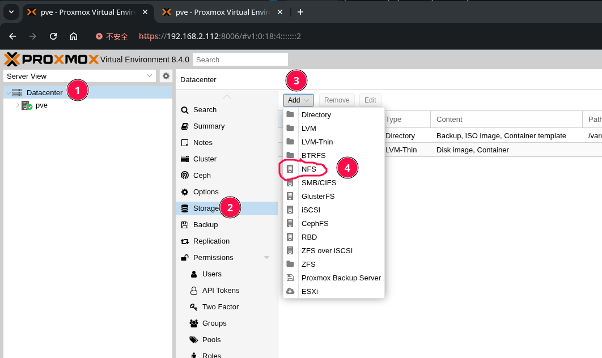
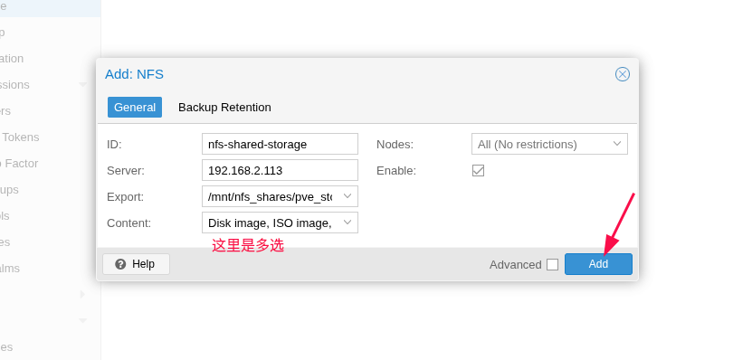
```shell
如是第二次挂载则需要
1. 强制解除可能存在的死锁挂载
umount -f -l /mnt/pve/nfs-shared-storage
(注：-f 是强制，-l 是懒惰卸载，即使连接卡死也能瞬间剥离)

2. 清理残留的空目录(按需)
PVE 在激活存储时如果发现本地目录没有清理干净或状态不对会拒绝执行，直接删掉这个占位目录：
rm -rf /mnt/pve/nfs-shared-storage
重启 PVE 的核心管理服务（关键）
这是最重要的一步，让 PVE 刷新它的存储状态机：
systemctl restart pvedaemon pveproxy pvestatd

如果是第二次或多次导致的nfs挂载不上，nfs在名字和路径等都相同的情况下则需要重启下esxi(玄学问题)

```
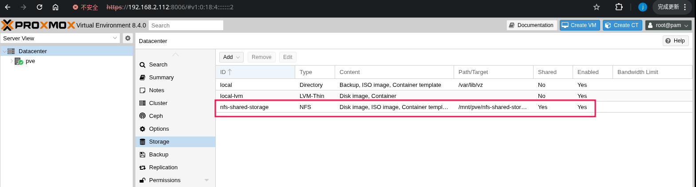


# 在ESXi8.0上挂载此NFS存储(为迁移做准备)
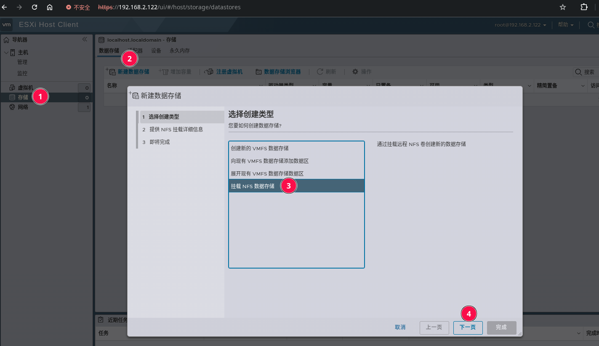
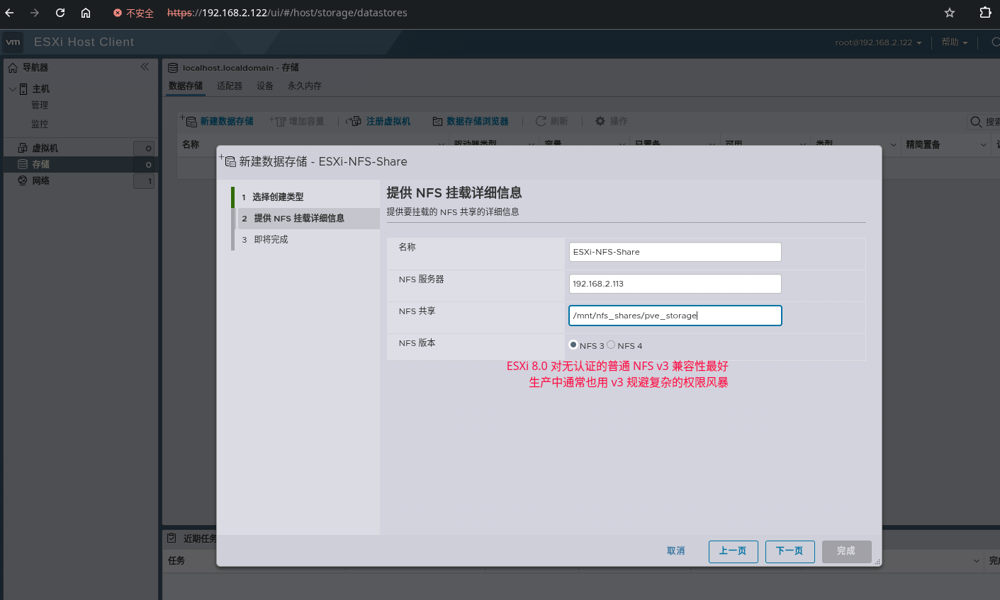
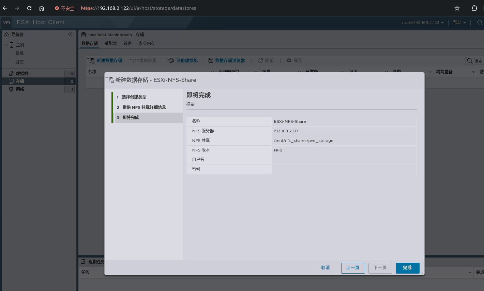
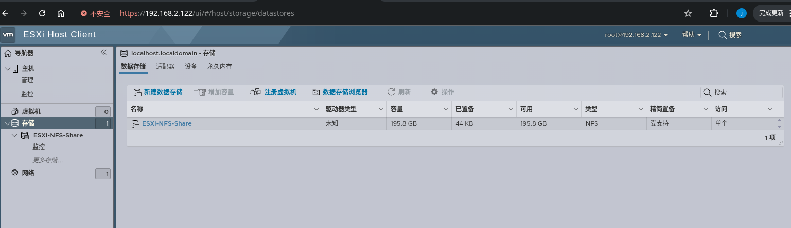

```shell
用以下方法验证是否合格:
在ESXi的ESXi-NFS-Share里随便上传一个ISO
登录PVE-Node-01的终端，查看ls /mnt/pve/nfs-shared-storage/template/iso/。如果你能在PVE里面看到刚刚在ESXi里上传的那个iso文件，说明两家虚拟化巨头已经共用了一个物理心脏
```
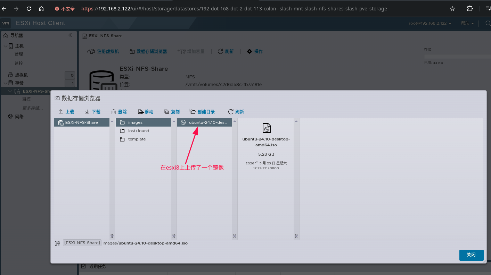
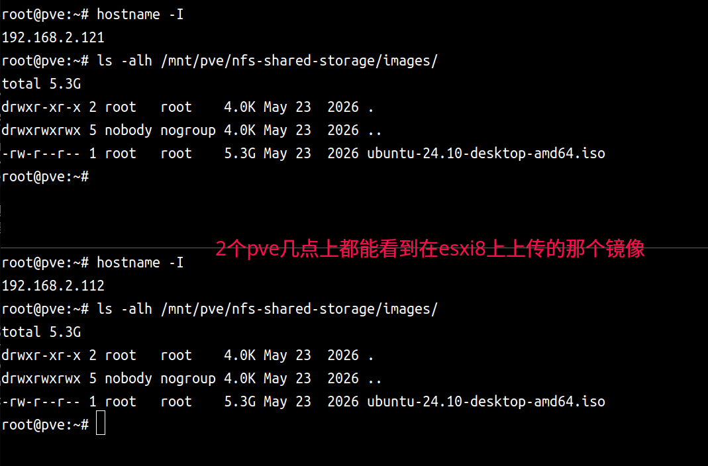


# 在esxi中装个linux系统(为迁移做准备)
```shell
在ESXi里面塞一个测试用的Linux小虚拟机，准备演练大厂最怕、开源最爱的 ESXi → PVE抽干迁移了

⚠️  大坑预警(90%的报错都在这里)
很多新手做实验，在ESXi里安装Linux时，磁盘控制器选的是普通的SATA或IDE。这种迁移到PVE闭着眼睛都能开机，没有任何技术含量
真实的企业VMware环境里，为了追求性能，虚拟机的磁盘控制器100%都是 VMware Paravirtual (PVSCSI)(VMware准虚拟化SCSI网卡/磁盘驱动)

应该怎么做：
在ESXi里面创建虚拟机时，故意将磁盘控制器选为 VMware Paravirtual 或 LSI Logic SAS
将网卡选为VMXNET3
正常安装完Linux系统，并在里面随便写几个文件(比如在 /root/test.txt 里写点字)，证明数据存在


# ============================== 如你和我的环境不同则这里可跳过 =====================================================
# 这里有个很关键的问题，就是我的宿主机是Linux mint,在mint的基础上安装的vmware workstation17pro, 在vmware workstation17pro里面安装了esxi，在esxi中安装linux时因为在ESXi8.0嵌套虚拟化(Nested)环境下，桥接模式安装linux报错连接错误，100%是卡在"网络混杂模式(Promiscuous Mode)" 和 "MAC地址安全策略"上。 如果你和我的环境不同则这里可跳过

# 第一步：修改最外层 VMware Workstation 的虚拟网卡权限(关键)
因为宿主机是 Linux Mint，VMware Workstation 在 Linux 下对桥接网卡的混杂模式有严格的系统权限限制

1、彻底关闭两台物理机上的 VMware Workstation(这里我没关)

2、打开 Linux Mint 的终端，放开网卡的混杂模式权限(假设你的物理网卡叫 eth0 或 enp3s0)
# 给 VMware 的虚拟网卡设备赋予读写权限
rambo@lab:~$ ls -alh /dev/vmnet*
crw------- 1 root root 119, 0  5月 23 05:19 /dev/vmnet0
crw------- 1 root root 119, 1  5月 23 05:20 /dev/vmnet1
crw------- 1 root root 119, 2  5月 23 05:20 /dev/vmnet2
crw------- 1 root root 119, 8  5月 23 05:20 /dev/vmnet8

rambo@lab:~$ sudo chmod a+rw /dev/vmnet*

rambo@lab:~$ ls -alh /dev/vmnet*
crw-rw-rw- 1 root root 119, 0  5月 23 05:19 /dev/vmnet0
crw-rw-rw- 1 root root 119, 1  5月 23 05:20 /dev/vmnet1
crw-rw-rw- 1 root root 119, 2  5月 23 05:20 /dev/vmnet2
crw-rw-rw- 1 root root 119, 8  5月 23 05:20 /dev/vmnet8

3、重新打开 VMware Workstation，确保 ESXi 虚拟机的网卡设置里桥接模式(Bridged)下勾选了"复制物理网络连接状态"(Replicate physical network connection state)

# 第二步: 修改ESXi8.0内部的虚拟交换机安全策略(致命核心)
即使外层放开了，ESXi8.0默认的虚拟交换机(vSwitch)安全策略也是极度严格的，它默认丢弃所有不是ESXi自身发出的流量
1. 登录ESXi8.0 Web后台
2. 点击左侧菜单的Networking(网络) --> 选择Virtual switches(虚拟交换机)标签页
3. 点击默认的vSwitch0，然后点击Edit settings(编辑设置)
4. 展开Security(安全)折叠菜单，将以下三项默认的Reject(拒绝) 全部改为 Accept(接受)
       Promiscuous mode(混杂模式) --> Accept
       MAC address changes(MAC地址更改) --> Accept
       Forged transmits(伪标传输) --> Accept
5. 点击Save(保存)

⚠️  注意：如果你使用了端口组(Port groups)，请点击Port groups标签页，对VM Network同样点击编辑设置，确保它的安全策略也继承了上述的Accept(接受)或者是单独改成了Accept

# 第三步：在Ubuntu 24.04 安装界面重试(这里我直接把要安装的虚拟机关机后重启后网络就都通了,如你的未通则继续以下步骤)
做完上述两步后，底层的网络管道才真正打通：
1.  在 Ubuntu 24.04 的安装界面，选中网络配置(Network Configuration)那一步
2.  如果它还是显示错误，选择那张网卡，点击 **Edit IPv4**，手动把它从 `DHCP` 改为 `Manual`（静态 IP），输入：
       Subnet: 192.168.2.0/24
       Address: 192.168.2.xx (给Ubuntu规划的IP)
       Gateway: 192.168.2.1 (你家路由器的网关，如果没有路由器直连，可以写我Mint的IP)
       Name servers: 8.8.8.8 或留空
3.  保存后点击 Rescan或者是直接下一步


```


# 迁移
## 迁移前奏
```shell
不同的客户情况不同，必须掌握以下两种手段：
流派A: 降维打击 --- PVE 8.x 官方原生API抽干(首选，最赚钱)
这是 Proxmox 官方近年专门为了应对 VMware 涨价大逃亡开发的"黑科技"。它不需要你登录ESXi 去导文件，PVE 自己会通过 API 去 ESXi 里面"偷"数据
1、在 PVE 界面配置集成： 登录 PVE-Node-02 (P360) 的 Web 后台。点击 Datacenter -> Storage -> Add -> 选择 ESXi
2、连接旧世界: 输入你ESXi的IP(192.168.1.22)、用户名(root)和密码
3、一键拉取: 此时，PVE的左侧菜单会直接多出一个 ESXi 的图标，点开它，你能直接肉眼看到你在ESXi里面运行的那台Linux虚拟机
4、在线导入: 选中它，点击Import(导入)，目标存储选择我们刚刚搭好的 nfs-shared-storage，网络桥接选择 PVE 的本地网卡。点击开始
5、底层逻辑: PVE会在后台自动调用 ovftool 或者内置转换流，把 VMware 的 vmdk 磁盘切片，一边拉取一边直接转换成 PVE 识别的格式，并自动注入 VirtIO 驱动


流派B：硬核命令行转换 --- 离线冷迁移(突发状况救命用)
如果客户的ESXi版本太旧(比如ESXi 5.5/6.0)，或者网络有防火墙，PVE官方工具连不上，就必须用底层命令行解决：
1、在ESXi里把这台 Linux 虚拟机关机
2、通过 ESXi 的 Datastore 浏览器，把该虚拟机的 .vmdk 文件直接下载到你的宿主机(我的是Linux Mint)，或者通过scp直接传到 PVE-Node-02 的 /root/ 目录下
3、在PVE命令行执行硬核转换：
     qemu-img convert -f vmdk -O qcow2 linux-vm.vmdk  linux-vm.qcow2
4. 在PVE里新建一个空虚拟机，然后用命令行把这个 `qcow2` 磁盘强行塞进去：
   qm importdisk <新VM_ID>  linux-vm.qcow2  nfs-shared-storage


不管用流派A还是流派B，当你把虚拟机迁移到PVE之后，点击Start(开机)
满分结果: 虚拟机顺利看到Grub引导菜单，顺利进入 Linux 登录界面，输入密码进去，/root/test.txt 文件完好无损

翻车结果(企业迁移最常见故障): 屏幕卡在 Gave up waiting for root file system device 或者蓝屏/黑屏，提示找不到硬盘
这就是因为 VMware 的 PVSCSI 驱动到了KVM架构下失效了


```


## 流派A
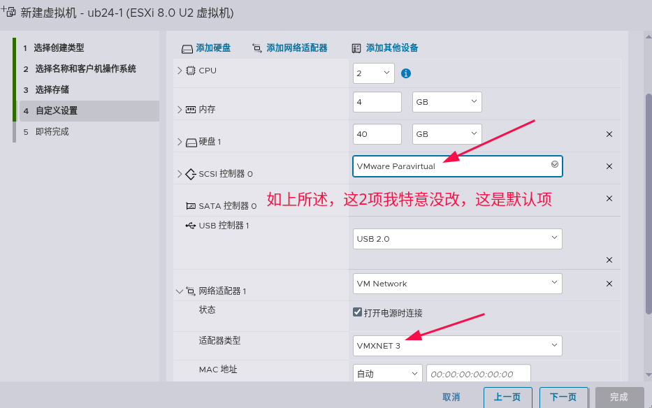
### 
```shell
# esxi8上的vm (ubuntu24.10)的源
rambo@test1:~$ sudo nano /etc/apt/sources.list
deb http://old-releases.ubuntu.com/ubuntu/ oracular main restricted universe multiverse
deb http://old-releases.ubuntu.com/ubuntu/ oracular-updates main restricted universe multiverse
deb http://old-releases.ubuntu.com/ubuntu/ oracular-security main restricted universe multiverse
deb http://old-releases.ubuntu.com/ubuntu/ oracular-backports main restricted universe multiverse


sudo apt update && sudo apt install vim wget curl net-tools openssh-client openssh-server -y
rambo@test1:~$ sudo systemctl enable --now ssh

# 是efi模式
rambo@test1:~$ ls /boot/efi/
EFI
rambo@test1:~$ ls /boot/efi/EFI/
BOOT  ubuntu


# 模拟数据
rambo@test1:~$ vim test.txt
i don't know
i'm sorry
yes, it's
good morning


# 迁移
esxi8上要迁移的vm必须先关机
```
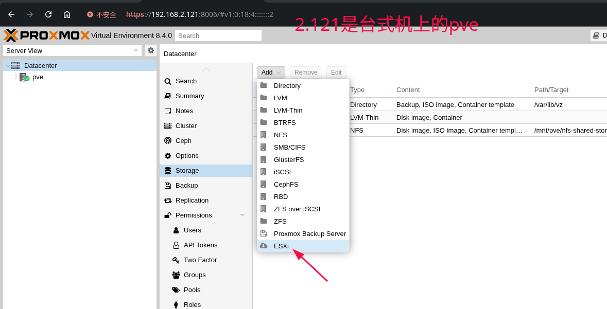
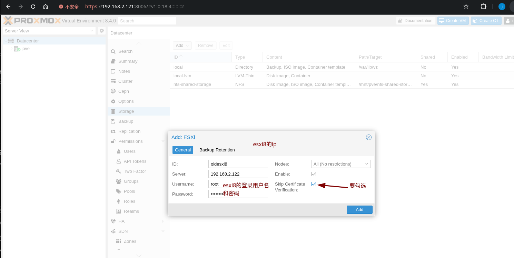
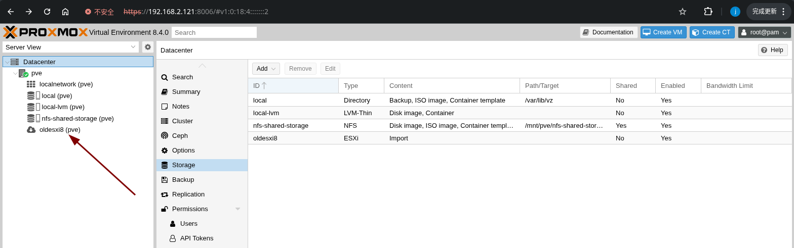
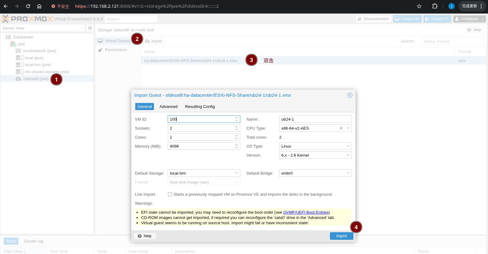
```shell
点击import后的底层逻辑: PVE会在后台自动调用ovftool或者内置转换流，把VMware的vmdk磁盘切片，一边拉取一边直接转换成PVE识别的格式，并自动注入VirtIO驱动

```

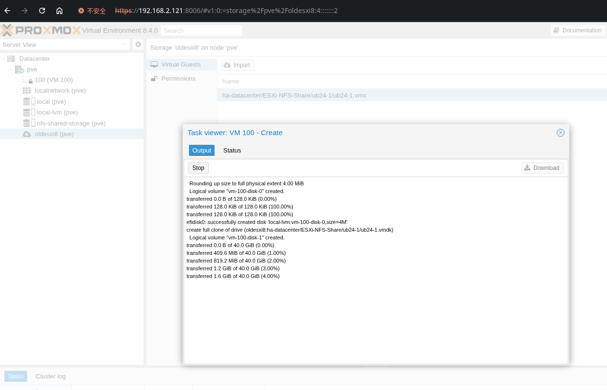
```shell
# ===================== vm不关机可能会报如下错 =============================
  Rounding up size to full physical extent 4.00 MiB
  Logical volume "vm-100-disk-0" created.
transferred 0.0 B of 128.0 KiB (0.00%)
transferred 128.0 KiB of 128.0 KiB (100.00%)
transferred 128.0 KiB of 128.0 KiB (100.00%)
efidisk0: successfully created disk 'local-lvm:vm-100-disk-0,size=4M'
create full clone of drive (oldesxi8:ha-datacenter/ESXi-NFS-Share/ub24-1/ub24-1.vmdk)
  Logical volume "vm-100-disk-1" created.
transferred 0.0 B of 40.0 GiB (0.00%)
qemu-img: error while reading at byte 0: Input/output error
  Logical volume "vm-100-disk-0" successfully removed.
  Logical volume "vm-100-disk-1" successfully removed.
TASK ERROR: unable to create VM 100 - cannot import from 'oldesxi8:ha-datacenter/ESXi-NFS-Share/ub24-1/ub24-1.vmdk' - copy failed: command '/usr/bin/qemu-img convert -p -n -f vmdk -O raw /run/pve/import/esxi/oldesxi8/mnt/ha-datacenter/ESXi-NFS-Share/ub24-1/ub24-1.vmdk zeroinit:/dev/pve/vm-100-disk-1' failed: exit code 1
# ===========================================================================
```
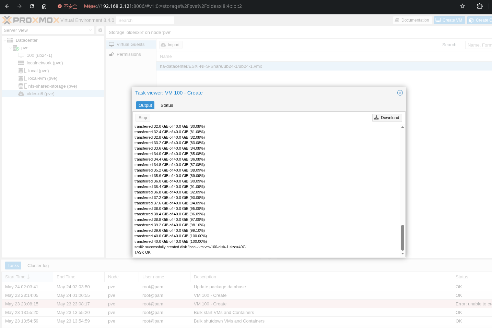
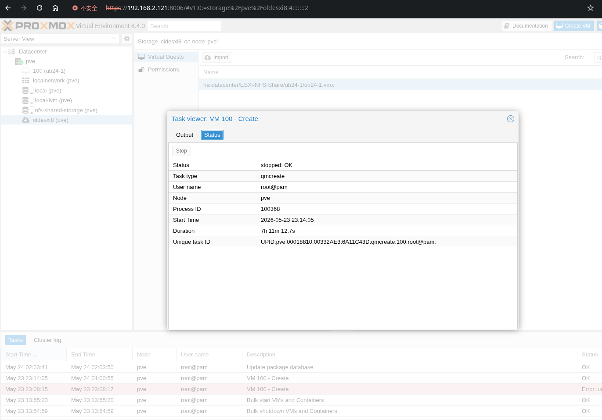
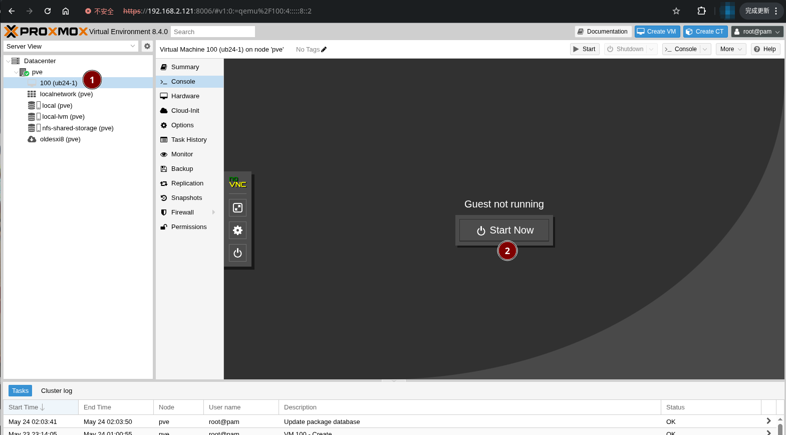
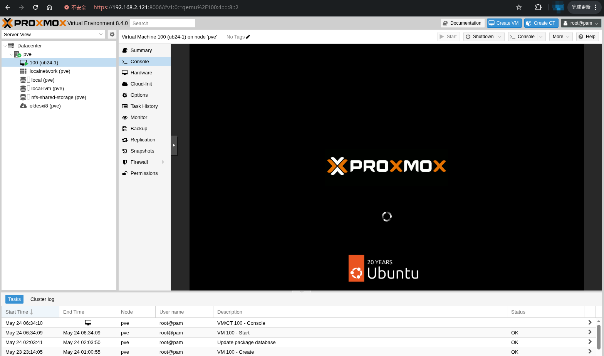
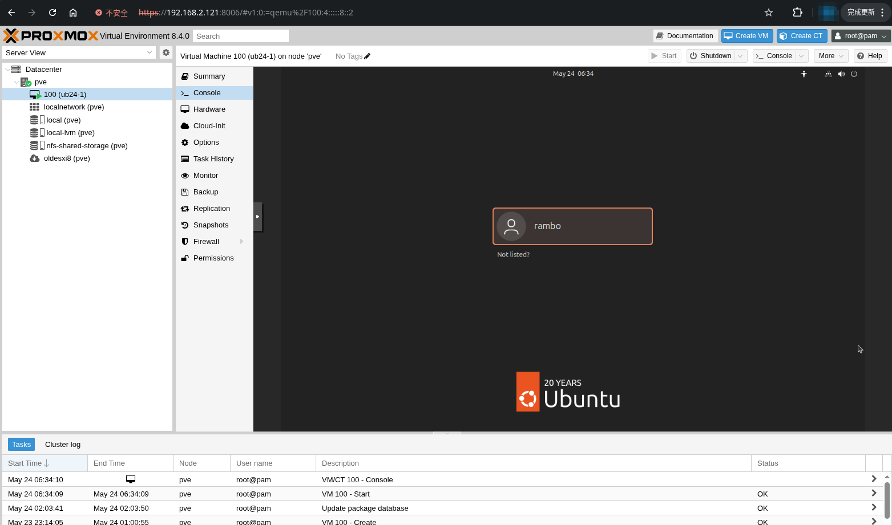
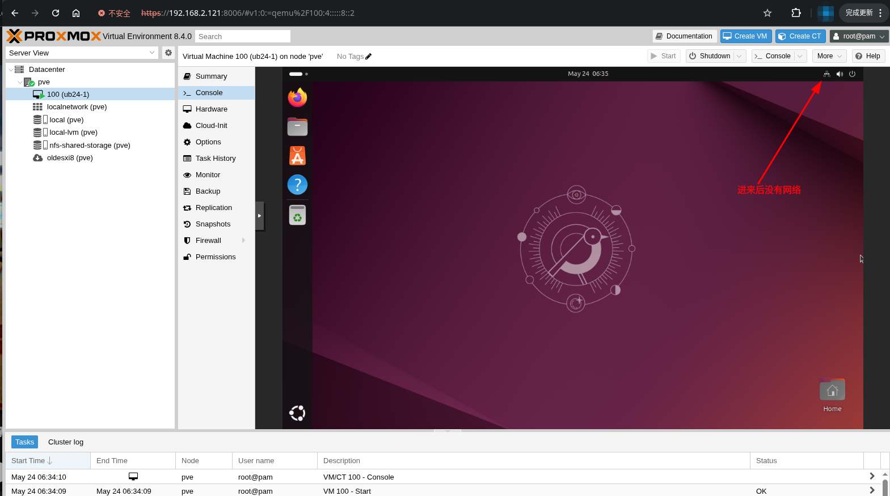
```shell
# 原因分析
在ESXi里这台虚拟机网卡用的是vmxnet3，还记得吧
但在PVE/KVM里默认变成VirtIO、Intel E1000
所以Linux内核会发现原来的网卡没了，于是原来ens160现在可能变成ens18或者eth0等等
所以系统启动后网络配置还在找ens160,但系统实际只有ens18所以网络直接失效
这是 VMware 迁移里最经典的问题

以下项目企业里迁移时全都会遇到这种情况
VMware
OpenStack
KVM
公有云


# 修复
注: 下面的问题应该是我有挂clash verge导致的，把clash关闭后重启了vmware后就都好了
```
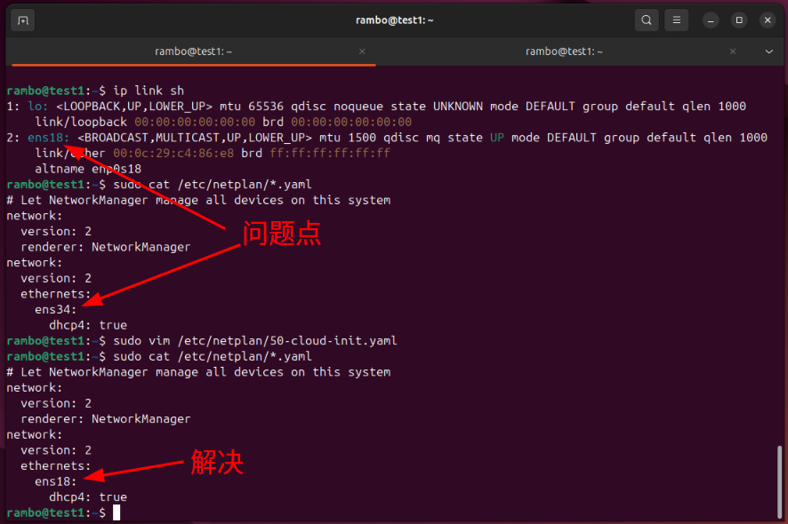
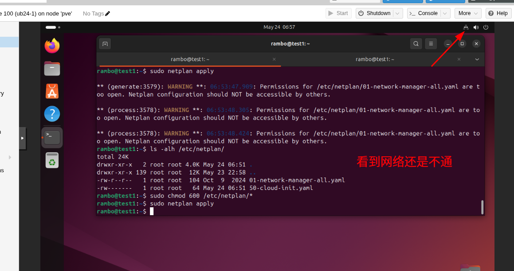
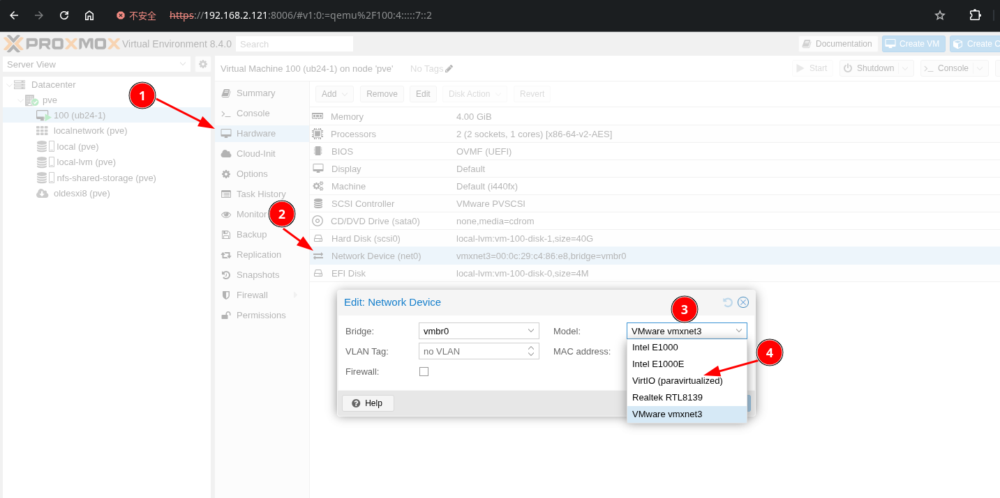
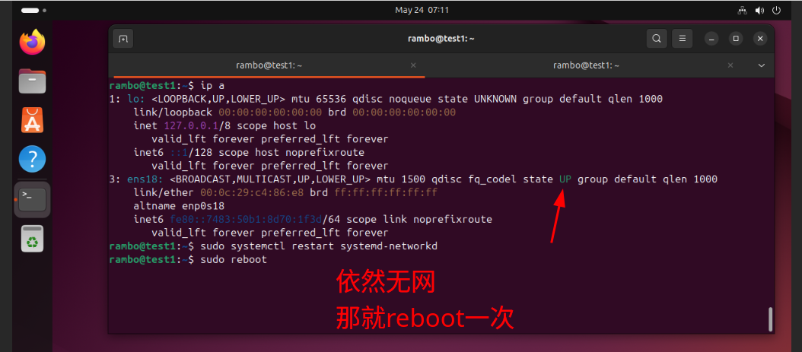
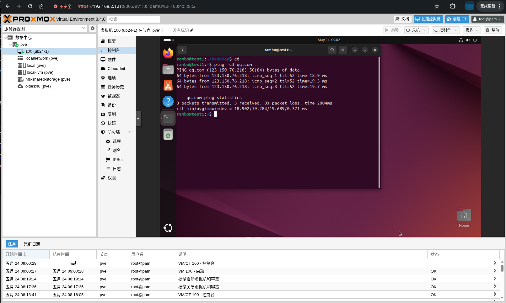


## 流派B
```shell


```


