[toc]

# 项目背景
```shell

2025-2026 年后VMware 被 Broadcom 收购后很多中小企业开始面临：
授权费用上涨
免费 ESXi 政策变化
Workstation 使用受限
vCenter 成本越来越高

因此越来越多企业开始寻找低成本虚拟化替代方案
其中KVM + QEMU + libvirt 已经成为Linux 世界事实上的标准虚拟化方案。

为什么选择KVM,因为KVM属于Linux Kernel 原生虚拟化，相比VMware：
优势
1）无高额授权成本
适合：
中小企业
边缘计算
私有云
IDC
2）与 Linux 深度整合
包括：
cgroups
systemd
nftables
NUMA
hugepages
3）云生态完整
包括：
OpenStack
Proxmox
oVirt
Kubernetes 虚拟化
4）更适合自动化
包括：
virsh
libvirt
Terraform
Ansible

很多人认为KVM只是VMware替代品, 实际上企业真正看中的是Linux 原生虚拟化生态
KVM最大优势不是 "免费" 而是可控, 包括：
Linux 原生
自动化
云生态
API
OpenStack
Kubernetes
Ceph

# 企业推荐虚拟磁盘方案
实验环境推荐qcow2, 生产环境更推荐raw或者LVM
qcow2优点：
snapshot
thin provisioning
节省空间

企业更喜欢raw是因为性能更高
qcow2存在：
metadata
copy-on-write
fragmentation

不建议所有VM放一个目录
错误示例 /var/lib/libvirt/images/ 全部混在一起
推荐结构, 例如：
/vm/
 ├── prod/
 ├── test/
 ├── backup/
 └── template/


很多人认为 qemu-img convert 就是迁移
实际上真正困难的是以下这些兼容层问题：
Snapshot chain
EFI/BIOS
Storage controller
initramfs
virtio
grub
network migration


本项目目标：
在 Debian12 上部署 KVM/libvirt 并将 VMware Workstation17Pro 的 Linux VM迁移到KVM/QEMU环境

本次迁移不是"新安装 Linux VM",而是真正的 VMware → KVM 企业迁移
因此会涉及：
VMware 快照链
VMDK consolidate
QCOW2 转换
libvirt
virt-install
BIOS/UEFI
dracut/initramfs
virtio 驱动
KVM 网络
qemu:///system
rescue 修复
等企业级问题


2026年生产环境宿主机更推荐Debian12,不推荐Ubuntu24 Desktop
尤其以下生态：
OpenStack
Ceph
KubeVirt
libvirt

很多人误以为KVM = 虚拟机
实际上KVM只是Linux Kernel Virtual Machine
真正架构：
virt-manager
    ↓
virt-install
    ↓
libvirt
    ↓
QEMU
    ↓
KVM(kernel)
    ↓
CPU VT-x / AMD-V

# 各组件作用
组件		作用
KVM		内核级虚拟化
QEMU		虚拟硬件模拟
libvirt	VM 	管理层
virsh		CLI管理工具
virt-install	创建VM
virt-manager	GUI管理器


# 解决vmware workstation17pro上的网络混杂模式(没找到这些操作)
VMware Workstation 17 Pro
进入Edit →  Virtual Network Editor
找到VMnet0
如果 Bridge to physical NIC
然后开启：
Promiscuous Mode
→ Allow All

企业迁移标准做法(重点): 迁移前必须先 consolidation,即合并 Snapshot
为什么必须先合并? 
因为KVM虽然支持部分 snapshot chain
但VMware Snapshot兼容性并不可靠, 尤其以下几种情况风险极高
多层 snapshot
加密 vmdk
NVMe snapshot
linked clone


# 加密 VMDK 注意事项
如果 Encrypted Virtual Machine 则 qemu-img 无法直接转换
必须先在 VMware 内解密

# 如何确认是否加密,查看：
qemu-img info xxx.vmdk

如果异常：
Unsupported or invalid disk type 或者 Permission denied
可能为加密VMDK

# 解密方式
VMware VM
→ Settings
→ Encryption
→ Remove Encryption

企业里真正推荐策略（重点）
永远不要直接迁移生产VM

而是
标准流程：
生产 VM
 ↓
完整克隆
 ↓
迁移 clone
 ↓
验证
 ↓
正式切换


# 企业推荐网络结构
NAT不适合生产, 更适合：
测试
实验
Nested

生产通常是bridge
Linux bridge企业方案, 例如：
bond0
 ↓
br0
 ↓
KVM VM

bridge更适合是因为VM拥有独立IP, 适合以下场景：
数据库
Web
Kubernetes
OpenStack

更大型环境通常用OVS(Open vSwitch),适合以下环境:
VLAN
VXLAN
SDN
OpenStack

企业推荐CPU配置 --cpu host-passthrough
优点：
性能更高
CPU 指令完整
NUMA 更友好

什么是 HugePages
Linux默认是4KB page
HugePages例如2MB、1GB

为什么NUMA很重要, 多CPU服务器,内存不是统一的

企业优化方向, 包括：
CPU pinning
NUMA binding
isolcpus

KVM企业高级优化, 包括：
vCPU pinning
emulatorpin
iothreadpin

virtio-scsi比virtio-blk更推荐
因为它支持：
多队列
热插拔
SCSI passthrough
企业兼容

企业数据库通常是virtio-scsi
企业生产环境强烈建议安装guest-agent
sudo dnf install qemu-guest-agent -y
sudo systemctl enable --now qemu-guest-agent
作用包括:
获取 VM IP
freeze filesystem
backup
graceful shutdown

企业不推荐长期snapshot是因为snapshot会导致：
IO下降
chain复杂
metadata增长
风险增加

snapshot只做短期, 长期应该backup
企业推荐备份包括：
rsync
borgbackup
PBS
Veeam
Ceph snapshot


企业迁移标准流程
1. 分析 VMware VM
   ↓
2. 判断 BIOS/EFI
   ↓
3. 判断 Snapshot
   ↓
4. consolidation
   ↓
5. clone
   ↓
6. vmdk → qcow2
   ↓
7. virt-install
   ↓
8. dracut repair
   ↓
9. grub repair
   ↓
10. network repair
   ↓
11. install guest-agent
   ↓
12. benchmark
   ↓
13. backup
   ↓
14. production cutover


企业迁移里最值钱的能力不是 apt install qemu-kvm 而是排错能力
真正值钱的是：
dracut
initramfs
grub
EFI
storage controller
snapshot chain
network migration

2026年大量企业因为以下原因都在kvm化
VMware成本压力
老旧ESXi
国产化
OpenStack
边缘计算


```


# 前奏
```shell
本次是围绕VMware Workstation → KVM/Qemu 迁移实验
将包含以下几个核心点，专攻单机虚拟化迁移：
磁盘转换
virtio
网络桥接
Windows 蓝屏
驱动问题
性能调优


企业长期路线选 Debian12 (主力，本次也将在该版本上做实验)
原因 稳、KVM 非常成熟、libvirt稳定、系统干净、企业味道重、Proxmox本质也是Debian
在debian上会安装QEMU、KVM、libvirt、virt-manager


学习兼容性路线选 Ubuntu
Ubuntu更适合：桌面、AI、新硬件
但KVM企业味不如 Debian，且Ubuntu经常：snap、自动更新、奇怪依赖，对生产思维不太友好


```


# 第一阶段必须掌握的东西
```shell
1、qemu-img (最核心)
比如磁盘转换，这是企业迁移核心：
qemu-img info xxx.vmdk
qemu-img convert -p -f vmdk test.vmdk -O qcow2 test.qcow2

虽然KVM可以直接读取VMDK, 但企业生产不推荐,原因如下:
性能
snapshot兼容
metadata兼容
lock问题
VMware特性残留


# 为什么推荐qcow2
KVM 常见磁盘格式：
格式	特点
raw	性能高
qcow2	灵活
vmdk	VMware

企业迁移通常推荐qcow2

# QCOW2优势包括
支持 snapshot
thin provisioning
压缩
稀疏文件
更适合KVM/libvirt

转换前重要原则(重点)必须保证：
VMDK已consolidation
即已删除所有snapshot 或者 已完整clone
否则极容易数据损坏

企业推荐磁盘类型
生产环境通常：
场景        推荐
OpenStack   qcow2
Proxmox	    raw/lvm
Ceph	    raw
测试环境    qcow2


2、virtio (重中之重)
企业性能核心
包括：
virtio-blk
virtio-scsi
virtio-net

3、bridge网络
企业里基本不用NAT
所以必须会：br0桥接

4、UEFI/BIOS
很多迁移失败，就是启动模式不一致

5、Windows 驱动
这是最容易翻车的
比如：蓝屏、INACCESSIBLE_BOOT_DEVICE

6、VMware 快照链问题(重点)
很多人直接 qemu-img convert
结果磁盘损坏, 原因是VMware使用Snapshot Chain

例如：
base.vmdk
    ↓
000001.vmdk
    ↓
000002.vmdk

真正数据可能在最后 delta disk


```


# 最优学习路线
```shell
第一阶段
单机：
VMware Workstation → KVM
掌握：
qemu-img
virtio
bridge
BIOS/UEFI
Windows 驱动

第二阶段上Proxmox
因为这是企业最容易成交的方案

第三阶段
研究：
live migration
Ceph
HA
SR-IOV
GPU passthrough

开始进入高端领域


```


# 实施
## 在Debian12上安装kvm环境
```shell
1、BIOS必须开启虚拟化
进入BIOS：
Intel：
    VT-x
    VT-d

AMD：
    SVM
    IOMMU

否则会报错：KVM acceleration can NOT be used


本次实验在vmware workstation17pro中的debian12上，网卡是NAT模式


rambo@debian1:~$ cat /etc/apt/sources.list
deb https://mirrors.aliyun.com/debian/ bookworm main non-free non-free-firmware contrib
deb-src https://mirrors.aliyun.com/debian/ bookworm main non-free non-free-firmware contrib
deb https://mirrors.aliyun.com/debian-security/ bookworm-security main
deb-src https://mirrors.aliyun.com/debian-security/ bookworm-security main
deb https://mirrors.aliyun.com/debian/ bookworm-updates main non-free non-free-firmware contrib
deb-src https://mirrors.aliyun.com/debian/ bookworm-updates main non-free non-free-firmware contrib
deb https://mirrors.aliyun.com/debian/ bookworm-backports main non-free non-free-firmware contrib
deb-src https://mirrors.aliyun.com/debian/ bookworm-backports main non-free non-free-firmware contrib
#zhongkeda
deb https://mirrors.ustc.edu.cn/debian/ bookworm main non-free non-free-firmware contrib
deb-src https://mirrors.ustc.edu.cn/debian/ bookworm main non-free non-free-firmware contrib
deb https://mirrors.ustc.edu.cn/debian-security/ bookworm-security main
deb-src https://mirrors.ustc.edu.cn/debian-security/ bookworm-security main
deb https://mirrors.ustc.edu.cn/debian/ bookworm-updates main non-free non-free-firmware contrib
deb-src https://mirrors.ustc.edu.cn/debian/ bookworm-updates main non-free non-free-firmware contrib
deb https://mirrors.ustc.edu.cn/debian/ bookworm-backports main non-free non-free-firmware contrib
deb-src https://mirrors.ustc.edu.cn/debian/ bookworm-backports main non-free non-free-firmware contrib


# 检查CPU虚拟化
rambo@debian1:~$ egrep -c '(vmx|svm)' /proc/cpuinfo
输出> 0即可，比如16则说明支持


先更新系统 (避免后续依赖问题)
不要跳过
rambo@debian1:~$ uname -a
Linux debian1 6.1.0-30-amd64 #1 SMP PREEMPT_DYNAMIC Debian 6.1.124-1 (2025-01-12) x86_64 GNU/Linux

rambo@debian1:~$ sudo apt update && sudo apt full-upgrade -y && sudo reboot
rambo@debian1:~$ uname -a
Linux debian1 6.1.0-48-amd64 #1 SMP PREEMPT_DYNAMIC Debian 6.1.172-1 (2026-05-15) x86_64 GNU/Linux


# 安装企业级KVM环境(2026稳定版组合)
rambo@debian1:~$ sudo apt install -y qemu-system \
qemu-utils qemu-kvm libvirt-daemon-system \
libvirt-clients virtinst virt-manager \
bridge-utils ovmf dnsmasq-base \
cpu-checker cloud-image-utils


# 验证KVM是否正常（重点）
rambo@debian1:~$ sudo kvm-ok
INFO: /dev/kvm exists
KVM acceleration can be used         # 有这一句则说明kvm正常


启动libvirt
rambo@debian1:~$ sudo systemctl enable --now libvirtd
rambo@debian1:~$ systemctl status libvirtd
● libvirtd.service - Virtualization daemon
     Loaded: loaded (/lib/systemd/system/libvirtd.service; enabled; preset: enabled)
     Active: active (running) since Thu 2026-05-21 06:39:31 EDT; 5s ago
TriggeredBy: ● libvirtd-admin.socket
             ● libvirtd.socket
             ● libvirtd-ro.socket
       Docs: man:libvirtd(8)
             https://libvirt.org
   Main PID: 22551 (libvirtd)
      Tasks: 19 (limit: 32768)
     Memory: 13.5M
        CPU: 514ms
     CGroup: /system.slice/libvirtd.service
             └─22551 /usr/sbin/libvirtd --timeout 120


# 把当前用户加入虚拟化组（避免权限问题）
virt-manager打不开
permission denied
qemu:///system连接失败
都是这一步没做

rambo@debian1:~$ sudo usermod -aG libvirt $USER && sudo usermod -aG kvm $USER

必须重新登录
rambo@debian1:~$ sudo reboot


验证 libvirt 是否正常（极重要）
rambo@debian1:~$ virsh list --all
 Id   Name   State
--------------------


# 检查QEMU版本(避免教程版本不一致)
rambo@debian1:~$ qemu-system-x86_64 --version
QEMU emulator version 7.2.22 (Debian 1:7.2+dfsg-7+deb12u18+b2)
Copyright (c) 2003-2022 Fabrice Bellard and the QEMU Project developers

注意：7.x 是稳定企业版本


# 配置libvirt默认网络
rambo@debian1:~$ virsh net-list --all
 Name   State   Autostart   Persistent
----------------------------------------

rambo@debian1:~$ sudo virsh net-define /usr/share/libvirt/networks/default.xml
注：有可能会报以下提示，这是正常的默认就会有default网络，只是没启动也没有vm接入
error: Failed to define network from /usr/share/libvirt/networks/default.xml
error: operation failed: network 'default' already exists with uuid 3b76875e-d749-4cf0-af30-7ee1322e12b7


# 启动默认网络
rambo@debian1:~$ sudo virsh net-start default

# 设置开机自启
rambo@debian1:~$ sudo virsh net-autostart default

rambo@debian1:~$ virsh net-list --all
 Name   State   Autostart   Persistent
----------------------------------------        # 还没有KVM VM接入所以没显示default网络

rambo@debian1:~$ ip a
1: lo: <LOOPBACK,UP,LOWER_UP> mtu 65536 qdisc noqueue state UNKNOWN group default qlen 1000
    link/loopback 00:00:00:00:00:00 brd 00:00:00:00:00:00
    inet 127.0.0.1/8 scope host lo
       valid_lft forever preferred_lft forever
    inet6 ::1/128 scope host noprefixroute 
       valid_lft forever preferred_lft forever
2: ens33: <BROADCAST,MULTICAST,UP,LOWER_UP> mtu 1500 qdisc fq_codel state UP group default qlen 1000
    link/ether 00:0c:29:47:1b:d2 brd ff:ff:ff:ff:ff:ff
    altname enp2s1
    inet 172.16.186.194/24 brd 172.16.186.255 scope global dynamic ens33
       valid_lft 1226sec preferred_lft 1226sec
7: virbr0: <NO-CARRIER,BROADCAST,MULTICAST,UP> mtu 1500 qdisc noqueue state DOWN group default qlen 1000
    link/ether 52:54:00:9f:da:2d brd ff:ff:ff:ff:ff:ff
    inet 192.168.122.1/24 brd 192.168.122.255 scope global virbr0
       valid_lft forever preferred_lft forever


真正结构就正确了
Windows/mint21(物理机)
   ↓
VMware NAT
   ↓
Debian12 ens33
   ↓
libvirt virbr0
   ↓
KVM VM

为什么这个方案正确？
因为libvirt 的 virbr0是 NAT bridge
不需要:
promiscuous mode
二层直通
VMware bridge

所以不会再触发 VMware 网卡的混杂模式(安全限制)


马上会开始接触：
qcow2
virtio
UEFI
libvirt XML
vCPU
cloud-init

这些才是企业迁移核心


```


## 迁移第一个Bios类型的Linux KVM VM
```shell
因为我的vmware workstation17pro上就有linux的vm, 所以我直接开始做迁移
迁移本质是什么？（第一性原理）
其实VMware VM 本质就是 vmdk + vmx
而KVM VM本质就是 qcow2/raw + xml

所以迁移核心其实只有磁盘格式转换

关于快照有2种情况：
第一种是我不保留任何快照，把所有快照都删除，只留base.vmdk，这个就不讲了，自行删除快照即可
第二种是完整克隆这台虚拟机，完整克隆会把所有快照合并到一个vmdk里面，这样实现快照合并的效果


现在先找 VMware VM 的 vmdk 文件(重点)
在VMware Workstation找到你的VM目录


重点：确认是哪种vmdk(非常重要)很多人这里翻车
rambo@bit:~/v_machine/alma9-1-new$ qemu-img info alma9-1-cl1.vmdk 
image: alma9-1-cl1.vmdk
file format: vmdk
virtual size: 80 GiB (85899345920 bytes)
disk size: 3.95 GiB
cluster_size: 65536
Format specific information:
    cid: 538008812
    parent cid: 4294967295
    create type: monolithicSparse
    extents:
        [0]:
            virtual size: 85899345920
            filename: alma9-1-cl1.vmdk
            cluster size: 65536
            format: 
如果create type 是 monolithicSparse最好
如果create type 是 twoGbMaxExtentSparse，说明分片VMDK，也能转但更容易踩坑

最稳做法(推荐)
先关机 VMware VM
不要 suspend
不要 snapshot
不建议直接迁移带快照链的VM，正确做法是先删除/合并快照(Consolidate)再迁移
因为VMware snapshot本质不是"完整备份"而是差异磁盘链
base.vmdk
base-000001.vmdk
base-000002.vmdk

实际上最新数据可能在最后一个delta文件里
很多人为什么迁移后数据丢失？
因为他们只转了base.vmdk 没转 -00000x.vmdk
结果VM启动了但数据回到了旧状态,这是企业真实事故

# 合并快照(来到实体机的vm目录下)
rambo@e8bit:~/v_machine/alma9-1$ ls -alh
总计 8.8G
drwxrwxr-x  4 rambo rambo 4.0K  5月 21 21:57 .
drwxr-xr-x 42 rambo rambo 4.0K  5月 20 18:10 ..
-rw-------  1 rambo rambo 109M  6月  8  2025 alma9-1-000001.vmdk
-rw-------  1 rambo rambo 169M  6月  8  2025 alma9-1-000002.vmdk
-rw-------  1 rambo rambo  36M  6月  8  2025 alma9-1-000003.vmdk
-rw-------  1 rambo rambo 1.3G  1月 16 16:06 alma9-1-000005.vmdk
-rw-rw-rw-  1 rambo rambo 7.4K 12月  9 17:52 alma9-1-0.scoreboard
-rw-------  1 rambo rambo 6.5M  5月 20 17:06 alma9-1-0.vmdk
-rw-rw-rw-  1 rambo rambo 7.4K 12月  8 19:42 alma9-1-1.scoreboard
-rw-------  1 rambo rambo 1.6M  5月 20 17:06 alma9-1-1.vmdk
-rw-rw-rw-  1 rambo rambo 7.4K 12月  7 16:52 alma9-1-2.scoreboard
-rw-------  1 rambo rambo 1.4M  5月 20 17:06 alma9-1-2.vmdk
-rw-------  1 rambo rambo 1.4M  5月 20 17:06 alma9-1-3.vmdk
-rw-------  1 rambo rambo 1.4M  6月  8  2025 alma9-1-4-000001.vmdk
-rw-------  1 rambo rambo 1.6M  6月  8  2025 alma9-1-4-000002.vmdk
-rw-------  1 rambo rambo 3.9G  6月  8  2025 alma9-1-4.vmdk
-rw-------  1 rambo rambo 1.4M  6月  8  2025 alma9-1-5-000001.vmdk
-rw-------  1 rambo rambo 1.5M  6月  8  2025 alma9-1-5-000002.vmdk
-rw-------  1 rambo rambo 202M  6月  8  2025 alma9-1-5.vmdk
-rw-------  1 rambo rambo 1.4M  6月  8  2025 alma9-1-6-000001.vmdk
-rw-------  1 rambo rambo 1.5M  6月  8  2025 alma9-1-6-000002.vmdk
-rw-------  1 rambo rambo 1.4M  6月  8  2025 alma9-1-6.vmdk
-rw-------  1 rambo rambo 1.4M  6月  8  2025 alma9-1-7-000001.vmdk
-rw-------  1 rambo rambo 1.4M  6月  8  2025 alma9-1-7-000002.vmdk
-rw-------  1 rambo rambo 1.4M  6月  8  2025 alma9-1-7.vmdk
-rw-------  1 rambo rambo 8.5K  1月 16 15:48 alma9-1.nvram
-rw-rw-rw-  1 rambo rambo 7.4K  1月 16 16:06 alma9-1.scoreboard
-rw-------  1 rambo rambo  29K  2月  3  2025 alma9-1-Snapshot1.vmsn
-rw-------  1 rambo rambo  29K  6月  8  2025 alma9-1-Snapshot3.vmsn
-rw-------  1 rambo rambo  29K  6月  8  2025 alma9-1-Snapshot4.vmsn
-rw-------  1 rambo rambo  29K  6月  8  2025 alma9-1-Snapshot5.vmsn
-rw-------  1 rambo rambo 3.2G  2月  3  2025 alma9-1.vmdk
-rw-r--r--  1 rambo rambo 2.5K  6月 18  2025 alma9-1.vmsd
-rwx------  1 rambo rambo 3.5K  1月 16 16:06 alma9-1.vmx
-rw-------  1 rambo rambo  262  1月 16 15:48 alma9-1.vmxf
drwxrwxrwx  2 rambo rambo 4.0K  5月 21 21:57 alma9-1.vmx.lck
drwxrwxr-x  2 rambo rambo 4.0K  2月  3  2025 mksSandbox
-rw-r-----  1 rambo rambo  53K 12月  9 17:52 mksSandbox-0.log
-rw-r-----  1 rambo rambo  55K 12月  8 19:42 mksSandbox-1.log
-rw-r-----  1 rambo rambo  53K 12月  7 16:52 mksSandbox-2.log
-rw-r-----  1 rambo rambo  53K  1月 16 16:06 mksSandbox.log
-rw-------  1 rambo rambo 211K 12月  9 17:52 vmware-0.log
-rw-------  1 rambo rambo 256K 12月  8 19:42 vmware-1.log
-rw-------  1 rambo rambo 200K 12月  7 16:52 vmware-2.log
-rw-------  1 rambo rambo 200K  1月 16 16:06 vmware.log

这个目录实际上已经是标准"企业真实生产 VM" 状态
因为这里不是简单单盘，而是 多磁盘 + 多快照链
这已经非常接近企业VMware环境

这个VM当前状态（重点分析）
这里最关键的是说明主系统盘存在 snapshot chain
alma9-1-000001.vmdk
alma9-1-000002.vmdk
alma9-1-000003.vmdk
alma9-1-000005.vmdk

而以下这些是额外数据盘，企业里很常见
alma9-1-0.vmdk
alma9-1-1.vmdk
alma9-1-2.vmdk


# VMware如何判断EFI
rambo@e8bit:~/v_machine$ cat xxx.vmx
注: 如存在firmware = "efi" 则说明是EFI，如无则通常是BIOS

# EFI 与 BIOS 最大区别
BIOS使用/boot/grub2
EFI使用/boot/efi

为什么EFI更容易翻车, 因为涉及：
NVRAM
OVMF
EFI partition
boot entry


迁移前必须先判断：
项目            内容
firmware        BIOS/EFI
controller      NVMe/SCSI/SATA
network	        vmxnet3/e1000
snapshot        是否存在
encryption      是否加密


命令完整克隆
rambo@e8bit:~/v_machine$ cp -ar alma9-1  alma9-1-bak      # 完整复制vm
rambo@e8bit:~/v_machine$ cd alma9-1-bak
rambo@e8bit:~/v_machine/alma9-1-bak$ 
Linux版 Workstation 自带 vmware-vdiskmanager 这才是企业真正会用的
先确认是否存在
rambo@e8bit:~/v_machine/alma9-1-bak$ which vmware-vdiskmanager
正常会在 /usr/bin/vmware-vdiskmanager
该工具可以：
✅ clone
✅ merge snapshot
✅ expand disk
✅ shrink disk
✅ convert disk

执行 Full Clone
rambo@e8bit:~/v_machine/alma9-1-bak$ vmware-vdiskmanager -r alma9-1.vmdk -t 0 alma9-1-clone.vmdk
命令释义：
-r: read source disk
-t 0 创建 single growable virtual disk, 也就是单一完整VMDK
这个过程会自动读取 snapshot chain, 也就是说即使 -000001.vmdk 存在，它也会合并最终状态，这其实就是命令行 Full Clone
完整克隆的作用可以自动合并所有快照链，并生成单一VMDK
推荐完整克隆的原因是因为：
安全
不破坏原VM
不需要手工找 parentFileNameHint
企业最常用


以下是回显：
Creating disk 'alma9-1-clone.vmdk'
  Convert: 100% done.
Virtual disk conversion successful.            # 说明snapshot chain已经被正确读取


rambo@e8bit:~/v_machine/alma9-1-bak$ ls -alh alma9-1-clone.vmdk 
-rw------- 1 rambo rambo 3.2G  5月 21 22:50 alma9-1-clone.vmdk
注意：它已经是完整磁盘

# 然后验证clone(非常重要)
rambo@e8bit:~/v_machine/alma9-1-bak$ qemu-img info alma9-1-clone.vmdk 
image: alma9-1-clone.vmdk
file format: vmdk
virtual size: 80 GiB (85899345920 bytes)
disk size: 3.18 GiB
cluster_size: 65536
Format specific information:
    cid: 2098440624
    parent cid: 4294967295                   #  即现在已经是独立完整磁盘
    create type: monolithicSparse            # 这是qemu-img 最喜欢的 VMware 格式
    extents:
        [0]:
            virtual size: 85899345920
            filename: alma9-1-clone.vmdk
            cluster size: 65536
            format: 
注意：理想情况(重点)会看到不再有backing file
我这个 clone已经没有加密限制
因为如果vmdk encryption 仍然有效，这里执行 qemu-img info通常会失败
很可能我加密的是VM 配置层，而不是VMDK data layer


所以我现在已经具备真正迁移条件下一步(核心),现在转 qcow2
在实体机上把 alma9-1-clone.vmdk 传到debian12上
企业习惯是放在/var/lib/libvirt/images/
rambo@bit:~/v_machine/alma9-1-bak$ scp alma9-1-clone.vmdk rambo@172.16.186.194:~

在Debian12上再移动一回，因为从实体机上直接发过来没权限直接到/var/lib/libvirt/images/
rambo@debian1:~$ sudo cp alma9-1-clone.vmdk  /var/lib/libvirt/images/             # 这是kvm的标准目录
rambo@debian1:/var/lib/libvirt/images$ sudo ls -alh
total 3.2G
-rw------- 1 root root 3.2G May 21 09:40 alma9-1-clone.vmdk


在 Debian12上正式转换（重点）
rambo@debian1:~$ cd /var/lib/libvirt/images/
rambo@debian1:/var/lib/libvirt/images$ sudo qemu-img convert \
-p \
-f vmdk alma9-1-clone.vmdk \
-O qcow2 alma9-1.qcow2
    (100.00/100%)           # 该行是回显

rambo@debian1:/var/lib/libvirt/images$ sudo ls -alh
total 6.4G
drwx--x--x 2 root root 4.0K May 21 09:41 .
drwxr-xr-x 7 root root 4.0K May 21 07:24 ..
-rw------- 1 root root 3.2G May 21 09:40 alma9-1-clone.vmdk
-rw-r--r-- 1 root root 3.2G May 21 09:42 alma9-1.qcow2

转换完成后检查(重要)
rambo@debian1:/var/lib/libvirt/images$ qemu-img info alma9-1.qcow2
image: alma9-1.qcow2
file format: qcow2                   # 格式已经更换
virtual size: 80 GiB (85899345920 bytes)
disk size: 3.18 GiB
cluster_size: 65536
Format specific information:
    compat: 1.1
    compression type: zlib
    lazy refcounts: false
    refcount bits: 16
    corrupt: false
    extended l2: false


这里其实已经完成企业迁移最核心部分，下一步才是真正KVM启动验证


# 查看原虚拟机的配置
rambo@bit:~/v_machine/alma9-1-bak$ cat alma9-1.vmx
#!/usr/bin/vmware
.encoding = "UTF-8"
displayName = "alma9-1"
config.version = "8"
virtualHW.version = "21"
mks.enable3d = "TRUE"
pciBridge0.present = "TRUE"
pciBridge4.present = "TRUE"
pciBridge4.virtualDev = "pcieRootPort"
pciBridge4.functions = "8"
pciBridge5.present = "TRUE"
pciBridge5.virtualDev = "pcieRootPort"
pciBridge5.functions = "8"
pciBridge6.present = "TRUE"
pciBridge6.virtualDev = "pcieRootPort"
pciBridge6.functions = "8"
pciBridge7.present = "TRUE"
pciBridge7.virtualDev = "pcieRootPort"
pciBridge7.functions = "8"
vmci0.present = "TRUE"
hpet0.present = "TRUE"
nvram = "alma9-1.nvram"
virtualHW.productCompatibility = "hosted"
powerType.powerOff = "soft"
powerType.powerOn = "soft"
powerType.suspend = "soft"
powerType.reset = "soft"
guestOS = "almalinux-64"
tools.syncTime = "FALSE"
sound.autoDetect = "TRUE"
sound.fileName = "-1"
sound.present = "TRUE"
numvcpus = "2"
cpuid.coresPerSocket = "1"
vcpu.hotadd = "TRUE"
memsize = "4096"
mem.hotadd = "TRUE"
nvme0.present = "TRUE"
nvme0:0.fileName = "alma9-1-000005.vmdk"         # 磁盘类型是nvme，这里要注意
nvme0:0.present = "TRUE"
ide1:0.deviceType = "cdrom-image"
ide1:0.fileName = "/home/rambo/下载/iso/AlmaLinux-9.5-x86_64-dvd.iso"
ide1:0.present = "TRUE"
usb.present = "TRUE"
svga.graphicsMemoryKB = "8388608"
ethernet0.connectionType = "nat"
ethernet0.addressType = "generated"
ethernet0.virtualDev = "vmxnet3"                 # 这里要注意，kvm中没有net3这个网络
ethernet0.present = "TRUE"
extendedConfigFile = "alma9-1.vmxf"
floppy0.present = "FALSE"
vmxstats.filename = "alma9-1.scoreboard"
uuid.bios = "56 4d ae ad 77 e5 46 4d-1b 4d d5 86 95 38 af 92"
uuid.location = "56 4d dc 5c a3 f1 04 5f-c7 c5 61 8e db 2a 9a 03"
pciBridge0.pciSlotNumber = "17"
pciBridge4.pciSlotNumber = "21"
pciBridge5.pciSlotNumber = "22"
pciBridge6.pciSlotNumber = "23"
pciBridge7.pciSlotNumber = "24"
usb.pciSlotNumber = "32"
ethernet0.pciSlotNumber = "160"
sound.pciSlotNumber = "33"
nvme0.pciSlotNumber = "192"
nvme0:0.redo = ""
svga.vramSize = "268435456"
vmotion.checkpointFBSize = "4194304"
vmotion.checkpointSVGAPrimarySize = "268435456"
vmotion.svga.mobMaxSize = "1073741824"
vmotion.svga.graphicsMemoryKB = "8388608"
vmotion.svga.supports3D = "1"
vmotion.svga.baseCapsLevel = "9"
vmotion.svga.maxPointSize = "189"
vmotion.svga.maxTextureSize = "16384"
vmotion.svga.maxVolumeExtent = "2048"
vmotion.svga.maxTextureAnisotropy = "16"
vmotion.svga.lineStipple = "1"
vmotion.svga.dxMaxConstantBuffers = "15"
vmotion.svga.dxProvokingVertex = "1"
vmotion.svga.sm41 = "1"
vmotion.svga.multisample2x = "1"
vmotion.svga.multisample4x = "1"
vmotion.svga.msFullQuality = "1"
vmotion.svga.logicOps = "1"
vmotion.svga.bc67 = "9"
vmotion.svga.sm5 = "1"
vmotion.svga.multisample8x = "1"
vmotion.svga.logicBlendOps = "1"
vmotion.svga.maxForcedSampleCount = "16"
vmotion.svga.gl43 = "1"
ethernet0.generatedAddress = "00:0c:29:38:af:92"
ethernet0.generatedAddressOffset = "0"
vmci0.id = "-1791447150"
nvme0.subnqnUUID = "52 71 29 79 8a a5 76 b0-16 fd 76 5a d6 f5 b8 0a"
monitor.phys_bits_used = "45"
cleanShutdown = "TRUE"
softPowerOff = "TRUE"
usb:1.speed = "2"
usb:1.present = "TRUE"
usb:1.deviceType = "hub"
usb:1.port = "1"
usb:1.parent = "-1"
svga.guestBackedPrimaryAware = "TRUE"
tools.capability.verifiedSamlToken = "TRUE"
guestInfo.detailed.data = "architecture='X86' bitness='64' cpeString='cpe:/o:almalinux:almalinux:9::baseos' distroAddlVersion='9.5 (Teal Serval)' distroName='AlmaLinux' distroVersion='9.5' familyName='Linux' kernelVersion='5.14.0-503.22.1.el9_5.x86_64' prettyName='AlmaLinux 9.5 (Teal Serval)'"
usb:0.present = "TRUE"
usb:0.deviceType = "hid"
usb:0.port = "0"
usb:0.parent = "-1"


在Debian12上先确认是否安装了, 如无则安装 sudo apt install virtinst -y
rambo@debian1:/var/lib/libvirt/images$ which virt-install
/usr/bin/virt-install


相比virt-manager,命令行更适合: 自动化、企业运维、CI/CD、批量迁移


开始真正创建VM(核心)
rambo@debian1:/var/lib/libvirt/images$ cd
rambo@debian1:~$ sudo virt-install \
--name alma9 \
--memory 4096 \
--vcpus 2 \
--cpu host-passthrough \
--disk /var/lib/libvirt/images/alma9-1.qcow2,format=qcow2,bus=virtio \
--network network=default,model=virtio \
--os-variant almalinux9 \
--import \
--graphics none

虽然--graphics none可用, 但迁移初期不建议, 因为启动失败时：
看不到 dracut
看不到 grub
不方便排错

virtio本质属于半虚拟化驱动, 相比以下几种性能高很多:
IDE
SATA
e1000

virtio-scsi相比virtio-blk的优势:
多队列
热插拔
更适合数据库
企业兼容更好

企业后续建议, 迁移完成后从 virtio-blk 升级virtio-scsi


不要关闭当前console, 另开ssh登录到debian12上
rambo@debian1:~$ virsh list --all


迁移前注意存储控制器变化
VMware → KVM
注意原vmdk磁盘格式，用 virtio-blk 或者 nvme，最稳的是virtio，因为Alma9内核默认支持
因为原VM不是SATA，所以启动虚拟机时要用bus=virtio,原因是KVM 的 NVMe兼容性不如 virtio 稳，对于新启动时企业里90% Linux KVM VM 都是virtio，因为这种性能和兼容性都是最好。但原vm是用的nvme的磁盘
KVM没有 vmxnet3所以我们必须用virtio-net
VMware虚拟磁盘控制器常见类型：(重点)scsi0: 、sata0: ide0: 、nvme0:

如报错：Disk /var/lib/libvirt/images/alma9-1.qcow2 is already in use by other guests ['alma9']. (Use --check path_in_use=off or --check all=off to override)
解决：
rambo@debian1:~$ virsh list --all
rambo@debian1:~$ virsh list --all --inactive
注: 应该都为空, 因为现在启动新vm时报错了

rambo@debian1:~$ virsh undefine alma9
rambo@debian1:~$ virsh dumpxml alma9
rambo@debian1:~$ sudo ls /etc/libvirt/qemu/      # 如有alma9.xml就删除
rambo@debian1:~$ sudo virsh undefine alma9

如果还是删不掉(少见)
直接 sudo rm -f /etc/libvirt/qemu/alma9.xml
然后 sudo systemctl restart libvirtd
查qemu进程
ps -ef | grep qemu
如果看到qemu-system-x86_64则说明残留VM进程还在
sudo kill -9 pid号

# 如还报错则查看日志
rambo@debian1:~$ sudo ls -alh /var/log/libvirt/qemu/           # 应该能看到 alma9.log
rambo@debian1:~$ sudo tail -50 /var/log/libvirt/qemu/alma9.log


下述图片中的这个dracut-initqueue timeout报错本质就是initramfs 里没有 virtio 磁盘驱动

导致的原因释义：
现在的状态(重点)
GRUB：✅ 正常
kernel：✅ 正常加载
但找不到 root filesystem，是因为原VMware用的是NVMe controller
现在KVM用的是virtio-blk
但 initramfs 里仍然只有 VMware/NVMe 驱动，没有virtio_blk。
所以系统启动到 dracut-initqueue，开始疯狂等待/dev/disk/by-uuid
但磁盘根本识别不出来，于是timeout，这就是企业迁移里最经典问题
尤其VMware → KVM/OpenStack


迁移后最容易启动失败是因为VMware 与 KVM虚拟硬件完全不同, 因此系统原来的initramfs,可能根本不包含KVM驱动
例如：
VMware       KVM
vmxnet3	     virtio-net
NVMe         virtio-blk
LSI Logic    virtio-scsi


启动后卡在:
dracut-initqueue timeout
或者：
Warning: /dev/disk/by-uuid/xxx does not exist
本质原因是initramfs 里没有 virtio 驱动,导致系统无法识别磁盘

VMware不会出现是因为原系统使用：
NVMe
vmware pvscsi
LSI Logic

而KVM使用：
virtio-blk
virtio-scsi

所以storage controller 已变化

RHEL/Alma/CentOS 更容易出现是因为默认hostonly=yes，即initramfs 只包含当前机器驱动，不是通用驱动


网络迁移 最经典问题
VMware 网卡是 ens160，KVM可能 ens3 导致 NetworkManager 找不到接口
修复方式
ip a
vim /etc/NetworkManager/system-connections/
或
vim /etc/sysconfig/network-scripts/
企业更推荐nmcli
例如nmcli connection show
修改 nmcli connection modify


```
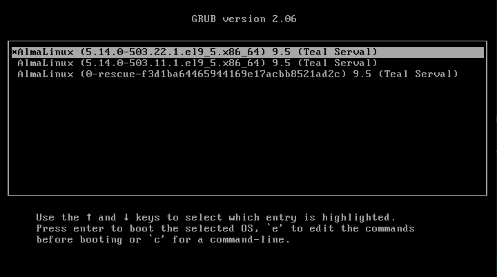
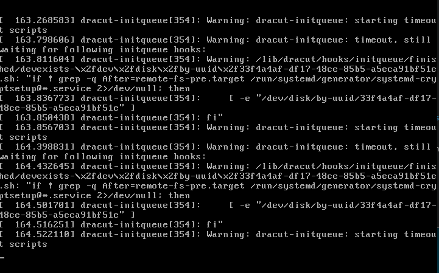

```

# 标准企业修复流程
先把Alma的 ISO放到 Debian12 的 /var/lib/libvirt/boot/ 中

# 重新挂ISO创建VM(重点)创建rescue VM
rambo@debian1:~$ sudo virt-install \
--name alma9-fix \
--memory 4096 \
--vcpus 2 \
--cpu host-passthrough \
--disk /var/lib/libvirt/images/alma9-1.qcow2,format=qcow2,bus=virtio \
--network network=default,model=virtio \
--cdrom /var/lib/libvirt/boot/AlmaLinux-9.5-x86_64-dvd.iso \
--graphics vnc,listen=0.0.0.0

rambo@debian1:~$ sudo ls -alh /var/lib/libvirt/boot/
-rw-r--r-- 1 root root  11G May 21 11:18 AlmaLinux-9.5-x86_64-dvd.iso

```
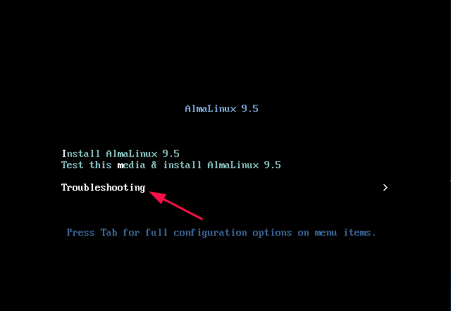
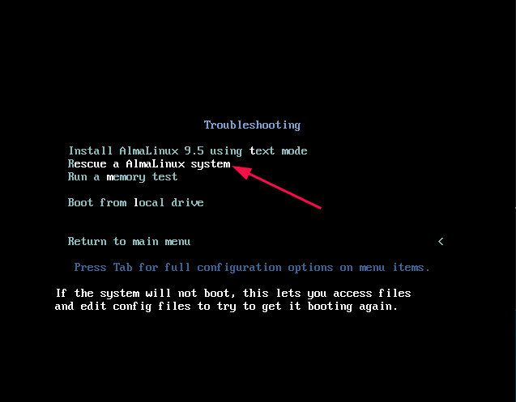
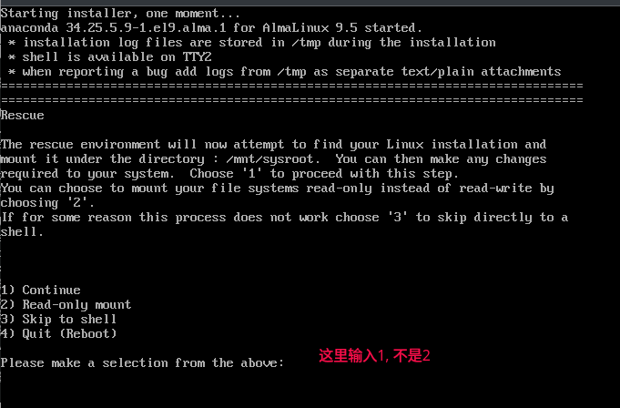

<font color=red>**它会自动搜索并挂载Alma9，通常是 /mnt/sysroot 或 /mnt/sysimage**</font>
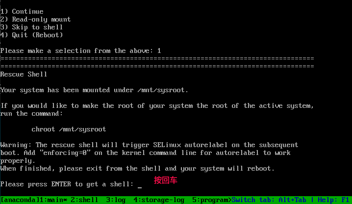
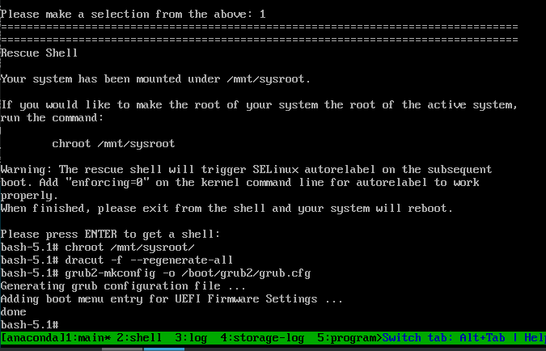
```shell
之所以要建议重建grub是因为从VMware NVMe迁移到了KVM virtio
查看磁盘 fdisk -l /dev/vda
重建 initramfs: dracut -f --regenerate-all

这一步能修复是因为现在系统看到的是
virtio-blk
dracut会自动把：
virtio
virtio_blk
virtio_pci
virtio_scsi

写入initramfs

# 企业里真正修复的不是grub而是驱动层, 验证 virtio 模块, 可选：
lsinitrd | grep virtio

正常会看到：
virtio_blk
virtio_pci

# 修复grub(重要)
BIOS系统
grub2-mkconfig -o /boot/grub2/grub.cfg
再
grub2-install /dev/vda

# 为什么是/dev/vda
因为KVM virtio设备名通常/dev/vda, 不是VMware原来的/dev/nvme0n1


```
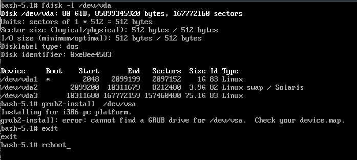
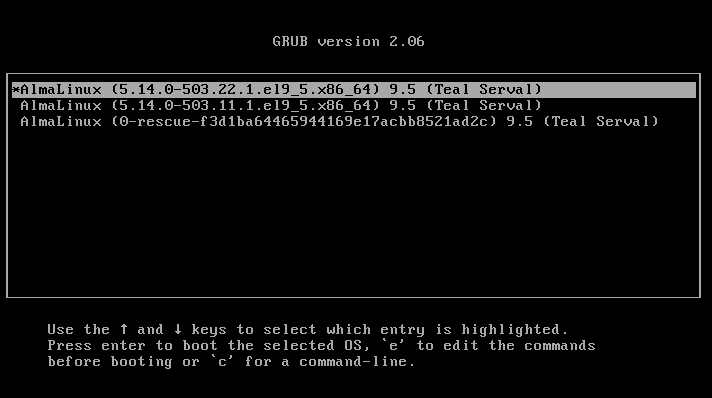
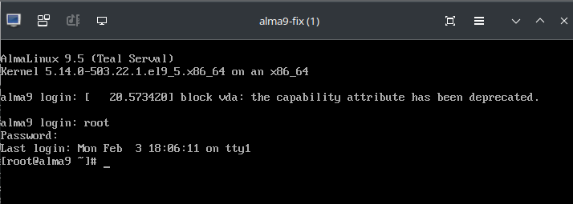


```shell
# 清理上述的错误环境
rambo@debian1:~$ ps -ef | grep qemu
注: 确保没有qemu-system-x86_64进程

rambo@debian1:~$ virsh list --all
 Id   Name   State
--------------------
注: 确保为空

rambo@debian1:~$ sudo ls /etc/libvirt/qemu/
alma9-fix.xml  networks
rambo@debian1:~$ sudo rm -rf /etc/libvirt/qemu/alma9-fix.xml             # 把原来关于alma9的xml删掉
rambo@debian1:~$ sudo virsh undefine alma9


libvirt其实有两套,所以需要确定当前默认使用的哪种
rambo@debian1:~$ virsh uri
qemu:///session

1、session mode(普通用户)
qemu:///session
VM运行在 ~/.config/libvirt/
有时候默认session mode
所以很多人会遇到VM明明启动了virsh list 却是空的
session mode：
网络能力弱
bridge麻烦
权限问题多
VM跟随用户登录
systemd控制差

2、system mode（企业生产）
qemu:///system
VM运行在/etc/libvirt/

企业里必须用 qemu:///system
因为针对以下项都更完整:
systemd管理
bridge/network
storage pool
autostart
权限
vhost-net


因为默认使用的是qemu:///session(用户模式)，而企业环境里应该默认用qemu:///system，修改如下:
rambo@debian1:~$ echo 'export LIBVIRT_DEFAULT_URI=qemu:///system' | sudo tee -a ~/.bashrc
rambo@debian1:~$ source ~/.bashrc

# 更底层的方法
rambo@debian1:~$ sudo vim /etc/libvirt/libvirt.conf
uri_default = "qemu:///system"

rambo@debian1:~$ sudo systemctl restart libvirtd


# 再验证
rambo@debian1:~$ virsh uri
qemu:///system
这一步完成后以下项默认都会走 system mode：
virsh
virt-install
virt-manager
virt-clone
virt-viewer


# 把光盘去掉不进rescue模式来重新启动新的vm
rambo@debian1:~$ sudo virt-install \
--name alma9 \
--memory 4096 \
--vcpus 2 \
--cpu host-passthrough \
--disk /var/lib/libvirt/images/alma9-1.qcow2,format=qcow2,bus=virtio \
--network network=default,model=virtio \
--os-variant almalinux9 \
--import \
--graphics vnc


# 启动虚拟机
rambo@debian1:~$ virsh start alma9


#============================================================
# 如果遇到明明vm已经正常启动了，但就是查不到时
rambo@debian1:~$ virsh list --all
 Id   Name   State
--------------------

rambo@debian1:~$ virsh uri
qemu:///session
问题在于现在查看的是用户级libvirt，不是系统级
而启动的vm大概率在qemu:///session

rambo@debian1:~$ sudo virsh -c qemu:///session list --all
 Id   Name    State
-----------------------
 1    alma9   running

原因分析:
libvirt其实有两套：

1、session mode(普通用户)
qemu:///session
VM运行在 ~/.config/libvirt/
有时候默认session mode
所以很多人会遇到VM明明启动了virsh list 却是空的
session mode：
网络能力弱
bridge麻烦
权限问题多
VM跟随用户登录
systemd控制差

2、system mode（企业生产）
qemu:///system
VM运行在/etc/libvirt/

企业里必须用 qemu:///system
因为针对以下项都更完整:
systemd管理
bridge/network
storage pool
autostart
权限
vhost-net

#============================================================

```


## KVM正确EFI启动方式(重点)
```shell
必须安装OVMF,OVMF简单说
QEMU/KVM 的 UEFI firmware, 相当于虚拟版UEFI BIOS
Debian12安装(重要) sudo apt install ovmf -y
# 确认文件存在
ls /usr/share/OVMF/        # 正常应有如下2个文件
OVMF_CODE.fd
OVMF_VARS.fd

如原VMware是EFI则KVM必须使用OVMF

BIOS/EFI不匹配会失败是因为, 例如原系统是EFI，现在KVM是BIOS, 则grub无法找到EFI boot
反之也可能无法启动

# EFI系统(重点)
如果原系统是EFI
则不要grub2-install /dev/vda
应该grub2-mkconfig -o /boot/efi/EFI/almalinux/grub.cfg
EFI更推荐使用 efibootmgr 修复 boot entry

在旧机上判断当前是EFI(在备份的基础上做)
rambo@bit:~/v_machine/ubuntu24-1-英-bak$ grep firmware ubuntu24-1-英.vmx
firmware = "efi"      # 存在该项则说明是EFI


# 在旧机上检查并合并快照(Consolidation)
rambo@bit:~/v_machine$ cp -ar ubuntu24-1-英  ubuntu24-1-英-bak
rambo@bit:~/v_machine$ cd ubuntu24-1-英-bak 
rambo@bit:~/v_machine/ubuntu24-1-英-bak$ ls -alh
总计 14G
drwxrwxr-x  4 rambo rambo 4.0K  5月 21 21:57 .
drwxr-xr-x 43 rambo rambo 4.0K  5月 22 18:10 ..
drwxrwxr-x  2 rambo rambo 4.0K  5月 20 17:52 mksSandbox
-rw-r-----  1 rambo rambo  53K  5月 20 18:46 mksSandbox-0.log
-rw-r-----  1 rambo rambo  57K  5月 20 18:43 mksSandbox-1.log
-rw-r-----  1 rambo rambo  54K  5月 21 15:32 mksSandbox.log
-rw-------  1 rambo rambo  11M  5月 20 18:46 ubuntu24-1-英-000001.vmdk
-rw-------  1 rambo rambo 5.2G  5月 21 15:32 ubuntu24-1-英-000003.vmdk
-rw-rw-r--  1 rambo rambo 7.5K  5月 20 18:46 ubuntu24-1-英-0.scoreboard
-rw-rw-r--  1 rambo rambo 7.5K  5月 20 18:43 ubuntu24-1-英-1.scoreboard
-rw-------  1 rambo rambo 265K  5月 21 07:58 ubuntu24-1-英.nvram
-rw-rw-r--  1 rambo rambo 7.5K  5月 21 15:32 ubuntu24-1-英.scoreboard
-rw-------  1 rambo rambo 285K  5月 20 18:46 ubuntu24-1-英-Snapshot1.vmsn
-rw-------  1 rambo rambo 285K  5月 20 18:46 ubuntu24-1-英-Snapshot2.vmsn
-rw-------  1 rambo rambo 8.8G  5月 20 18:46 ubuntu24-1-英.vmdk
-rw-r--r--  1 rambo rambo  756  5月 20 18:46 ubuntu24-1-英.vmsd
-rwx------  1 rambo rambo 3.3K  5月 21 15:32 ubuntu24-1-英.vmx
-rw-------  1 rambo rambo  296  5月 21 07:57 ubuntu24-1-英.vmxf
drwxrwxr-x  2 rambo rambo 4.0K  5月 21 17:46 ubuntu24-1-英.vmx.lck
-rw-r--r--  1 rambo rambo 213K  5月 20 18:46 vmware-0.log
-rw-r--r--  1 rambo rambo 262K  5月 20 18:43 vmware-1.log
-rw-------  1 rambo rambo 233K  5月 21 15:32 vmware.log

如果存在快照文件: 
切记不能直接转base.vmdk。由于你已经是在备份目录操作，最稳妥的做法是确保你在VMware里已经对该虚拟机执行了"删除所有快照/合并快照(Consolidated)"，或者在转换时直接指定最新的那个 *-00000x.vmdk 差异磁盘进行转换

如果已经是干净的、无快照的单个完整vmdk(例如ubuntu24-1-英.vmdk)，则直接进入下一步

# 在旧机上完整克隆(合并所有快照)
rambo@bit:~/v_machine/ubuntu24-1-英-bak$ ls -alh *.vmdk
-rw------- 1 rambo rambo  11M  5月 20 18:46 ubuntu24-1-英-000001.vmdk
-rw------- 1 rambo rambo 5.2G  5月 21 15:32 ubuntu24-1-英-000003.vmdk
-rw------- 1 rambo rambo 8.8G  5月 20 18:46 ubuntu24-1-英.vmdk
rambo@bit:~/v_machine/ubuntu24-1-英-bak$ vmware-vdiskmanager -r ubuntu24-1-英.vmdk -t 0 ubuntu24-1-英-clone.vmdk
Creating disk 'ubuntu24-1-英-clone.vmdk'
  Convert: 100% done.
Virtual disk conversion successful.           # 说明snapshot chain已经被正确读取

rambo@e8bit:~/v_machine/ubuntu24-1-英-bak$ ls -alh ubuntu24-1-英-clone.vmdk
-rw------- 1 rambo rambo 8.8G  5月 22 18:56 ubuntu24-1-英-clone.vmdk

# 在旧机上验证克隆
rambo@bit:~/v_machine/ubuntu24-1-英-bak$ qemu-img info ubuntu24-1-英-clone.vmdk
image: ubuntu24-1-英-clone.vmdk
file format: vmdk
virtual size: 80 GiB (85899345920 bytes)
disk size: 8.71 GiB
cluster_size: 65536
Format specific information:
    cid: 1358216815
    parent cid: 4294967295
    create type: monolithicSparse
    extents:
        [0]:
            virtual size: 85899345920
            filename: ubuntu24-1-英-clone.vmdk
            cluster size: 65536
            format: 


# 在旧机上将克隆合并后的单体vmdkK磁盘传输至kvm宿主机(就是debian12那台)
rambo@bit:~/v_machine/ubuntu24-1-英-bak$ scp ubuntu24-1-英-clone.vmdk rambo@172.16.186.194:~
注: 194是debian12的IP

# 来到debian12上
rambo@debian1:~$ ls -alh ubuntu24-1-英-clone.vmdk 
-rw------- 1 rambo rambo 8.8G May 21 16:19 ubuntu24-1-英-clone.vmdk

rambo@debian1:~$ sudo cp ubuntu24-1-英-clone.vmdk  /var/lib/libvirt/images/
rambo@debian1:~$ cd /var/lib/libvirt/images/

# 开始转换
rambo@debian1:/var/lib/libvirt/images$ sudo qemu-img convert \
-p \
-f vmdk ubuntu24-1-英-clone.vmdk\
-O qcow2 ubuntu24-1-英-clone.qcow2

rambo@debian1:/var/lib/libvirt/images$ sudo ls -alh 
total 24G
drwx--x--x 2 root         root         4.0K May 21 16:49 .
drwxr-xr-x 7 root         root         4.0K May 21 07:24 ..
-rw------- 1 root         root         3.2G May 21 09:40 alma9-1-clone.vmdk
-rw-r--r-- 1 libvirt-qemu libvirt-qemu 3.4G May 21 16:51 alma9-1.qcow2
-rw-r--r-- 1 root         root         8.8G May 21 16:52 ubuntu24-1-英-clone.qcow2
-rw------- 1 root         root         8.8G May 21 16:24 ubuntu24-1-英-clone.vmdk


rambo@debian1:/var/lib/libvirt/images$ sudo chown libvirt-qemu:libvirt-qemu /var/lib/libvirt/images/ubuntu24-1-英-clone.qcow2
rambo@debian1:/var/lib/libvirt/images$ sudo chmod 660 /var/lib/libvirt/images/ubuntu24-1-英-clone.qcow2


这里其实已经完成企业迁移最核心部分，下一步才是真正KVM启动验证


# 使用virt-install创建KVM虚拟机(关键:指定OVMF / EFI固件)
# 查看原虚拟机的配置
rambo@e8bit:~/v_machine/ubuntu24-1-英-bak$ cat ubuntu24-1-英.vmx
#!/usr/bin/vmware
.encoding = "UTF-8"
displayName = "ubuntu24-1-英"
config.version = "8"
virtualHW.version = "21"
mks.enable3d = "TRUE"
pciBridge0.present = "TRUE"
pciBridge4.present = "TRUE"
pciBridge4.virtualDev = "pcieRootPort"
pciBridge4.functions = "8"
pciBridge5.present = "TRUE"
pciBridge5.virtualDev = "pcieRootPort"
pciBridge5.functions = "8"
pciBridge6.present = "TRUE"
pciBridge6.virtualDev = "pcieRootPort"
pciBridge6.functions = "8"
pciBridge7.present = "TRUE"
pciBridge7.virtualDev = "pcieRootPort"
pciBridge7.functions = "8"
vmci0.present = "TRUE"
hpet0.present = "TRUE"
nvram = "ubuntu24-1-英.nvram"
virtualHW.productCompatibility = "hosted"
powerType.powerOff = "soft"
powerType.powerOn = "soft"
powerType.suspend = "soft"
powerType.reset = "soft"
guestOS = "ubuntu-64"
tools.syncTime = "FALSE"
sound.autoDetect = "TRUE"
sound.fileName = "-1"
sound.present = "TRUE"
numvcpus = "6"
cpuid.coresPerSocket = "3"
vcpu.hotadd = "TRUE"
memsize = "16384"
mem.hotadd = "TRUE"
scsi0.virtualDev = "lsilogic"
scsi0.present = "TRUE"
sata0.present = "TRUE"
scsi0:0.fileName = "ubuntu24-1-英-000003.vmdk"                  # 磁盘类型是scsi，这里要注意
scsi0:0.present = "TRUE"
sata0:1.deviceType = "cdrom-image"
sata0:1.fileName = "/home/rambo/下载/iso/ubuntu-24.04.1-desktop-amd64.iso"
sata0:1.present = "TRUE"
usb.present = "TRUE"
svga.graphicsMemoryKB = "8388608"
ethernet0.connectionType = "nat"
ethernet0.addressType = "generated"
ethernet0.virtualDev = "e1000"        
ethernet0.present = "TRUE"
extendedConfigFile = "ubuntu24-1-英.vmxf"
floppy0.present = "FALSE"
firmware = "efi"
vmxstats.filename = "ubuntu24-1-英.scoreboard"
uuid.bios = "56 4d 99 b2 59 f1 9f a9-33 a7 69 a4 f5 03 a2 90"
uuid.location = "56 4d 99 b2 59 f1 9f a9-33 a7 69 a4 f5 03 a2 90"
pciBridge0.pciSlotNumber = "17"
pciBridge4.pciSlotNumber = "21"
pciBridge5.pciSlotNumber = "22"
pciBridge6.pciSlotNumber = "23"
pciBridge7.pciSlotNumber = "24"
scsi0.pciSlotNumber = "16"
usb.pciSlotNumber = "32"
ethernet0.pciSlotNumber = "33"
sound.pciSlotNumber = "34"
sata0.pciSlotNumber = "35"
scsi0:0.redo = ""
svga.vramSize = "268435456"
vmotion.checkpointFBSize = "4194304"
vmotion.checkpointSVGAPrimarySize = "268435456"
vmotion.svga.mobMaxSize = "1073741824"
vmotion.svga.graphicsMemoryKB = "8388608"
vmotion.svga.supports3D = "1"
vmotion.svga.baseCapsLevel = "9"
vmotion.svga.maxPointSize = "189"
vmotion.svga.maxTextureSize = "16384"
vmotion.svga.maxVolumeExtent = "2048"
vmotion.svga.maxTextureAnisotropy = "16"
vmotion.svga.lineStipple = "1"
vmotion.svga.dxMaxConstantBuffers = "15"
vmotion.svga.dxProvokingVertex = "1"
vmotion.svga.sm41 = "1"
vmotion.svga.multisample2x = "1"
vmotion.svga.multisample4x = "1"
vmotion.svga.msFullQuality = "1"
vmotion.svga.logicOps = "1"
vmotion.svga.bc67 = "9"
vmotion.svga.sm5 = "1"
vmotion.svga.multisample8x = "1"
vmotion.svga.logicBlendOps = "1"
vmotion.svga.maxForcedSampleCount = "16"
vmotion.svga.gl43 = "1"
ethernet0.generatedAddress = "00:0c:29:03:a2:90"
ethernet0.generatedAddressOffset = "0"
vmci0.id = "-184311152"
monitor.phys_bits_used = "45"
cleanShutdown = "TRUE"
softPowerOff = "TRUE"
usb:1.speed = "2"
usb:1.present = "TRUE"
usb:1.deviceType = "hub"
usb:1.port = "1"
usb:1.parent = "-1"
svga.guestBackedPrimaryAware = "TRUE"
usb:0.present = "TRUE"
usb:0.deviceType = "hid"
usb:0.port = "0"
usb:0.parent = "-1"


rambo@debian1:~$ sudo virt-install \
--name ubuntu24-clone  \
--ram 4096 \
--vcpus 2 \
--cpu host-passthrough \
--disk path=/var/lib/libvirt/images/ubuntu24-1-英-clone.qcow2,bus=virtio,format=qcow2 \
--network bridge=virbr0,model=virtio \
--boot uefi \                                  # 重点，libvirt会自动加载OVMF
--graphics vnc,listen=0.0.0.0 \
--noautoconsole \
--os-variant ubuntu22.10 \
--import

注: 根据你宿主机的实际网桥名如 br0 或 virbr0 调整 --network项
核心参数：
--boot uefi：这是对应你 firmware = "efi" 最关键的一步，KVM会自动为其分配OVMF固件引导
bus=virtio 和 model=virtio：直接采用半虚拟化驱动以获取企业级性能


# 查看系统支持的所有可选值 (--os-variant的可选值)
rambo@debian1:~$ osinfo-query os | grep -i ubuntu                     # 新方法
rambo@debian1:~$ virt-install --osinfo list | grep -i ubuntu          # 旧方法
ubuntu22.10, ubuntukinetic
ubuntu-lts-latest, ubuntu-stable-latest, ubuntu22.04, ubuntujammy
注: 
可以看到最高支持到ubuntu22, 并没有24版本, 对于内核版本较新的 Ubuntu 24.04 来说，KVM宿主机在把它识别为ubuntu22.04时配置的底层硬件行为（如 ACPI 电源管理、RTC 时钟同步、VirtIO 默认驱动支持等）与 24.04 是高度一致的。这不会对虚拟机的运行带来任何性能损耗或不兼容问题

#=================== 如需重新创建该vm ==============
#1. 强制关闭虚拟机
sudo virsh destroy ubuntu24-clone

# 2. 从libvirt中彻底解除该虚拟机的定义
sudo virsh undefine ubuntu24-clone --nvram
# 重新执行 sudo virt-install ....
#===================================================

rambo@debian1:~$ source .bashrc 
rambo@debian1:~$ virsh uri
qemu:///system

rambo@debian1:~$ virsh list --all
 Id   Name             State
--------------------------------
 1    alma9            running
 2    ubuntu24-clone   running


rambo@debian1:~$ sudo netstat -anpt | grep 590
tcp        0      0 127.0.0.1:5900          0.0.0.0:*               LISTEN      8377/qemu-system-x8 
tcp        0      0 0.0.0.0:5901            0.0.0.0:*               LISTEN      9803/qemu-system-x8 
tcp        0      0 172.16.186.194:5901     172.16.186.1:38178      ESTABLISHED 9803/qemu-system-x8 
用远程连接工具去连接172.16.186.194:5901就能看到如下画面

```

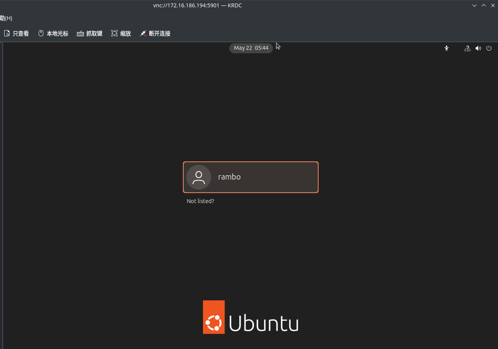


```
# ===================================================
企业里最常见报错：
No boot device
其实80% 是 EFI/BIOS 不一致
企业虚拟化迁移真正难的地方不是qemu-img
而是：
firmware
controller
boot chain
initramfs
driver
这些兼容层
# ===================================================

创建后查看VM(重点)
rambo@debian1:~$ virsh list --all
 Id   Name             State
--------------------------------
 1    alma9            running
 3    ubuntu24-clone   running

启动VM
rambo@debian1:~$ virsh start ubuntu24-clone

进入控制台（重点）
rambo@debian1:~$ virsh console ubuntu24-clone
退出 Ctrl + ]


```


# 
```shell


```
